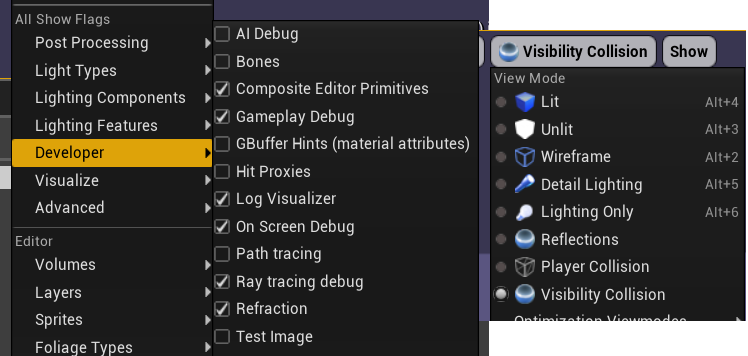
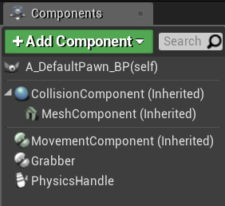

# Float
There are proper Formatting for type Float.
but witout that, it still works bacuse complier implicitly work.


lets see below, if declare float like this
```c++
float num = 10.0 -> float num = 10.f
float num = 10   -> float num = 10.f
```

# Collision
 UE4 Support Collision matter. There are several ways to deal with this problem. 


## Get Collision when you get the model
This is the best. Just create collision with model when you build it. and import that on UE4

 
### 1. Complex Collision as Simple
You can use simple collision and Complex collision.
 Complex collision makes collision mesh coordinate with static Mesh Actor.
 
 the problem is that whenever excute this sene, the computer have to calculate that collision box. If it takes Higher Polygon, it takes more. So making Simple Polygon would solve this problem

### 2. Using Geometry Cube(BSP)
This cubes are simple so proper for making low poligon Just make it and applying above would work as exffectivly. 

### 3. Just delete Collision 
Just Edit Collision and delete it on Door Frame. In this case you didn't needs collision. It is not just simple, but not waste any resources.
But Don't do that in door, It needs collision

## Clean up your Directory
Redirectory File help to find moved files, when UE4 refering the directory before moved off.

After Delete or Replace your Asset, Fixing Up your Redirectory Folder else, deleted file's redirectory stil be there.


# Rotator
This type is saving the transfrom information 
```c++
// Made it with Initializing
FRotator NewRotatorInfo1(0.f, 0.f,10.f); 
// Declare Variable and Assigning values on it
FRotator NewRotatorInfo2 = {0.f, 0.f,20.f}; 
```


# Set the Default Game Mode
You want to add implementation on your Character for grap the materials, for that you have to set your Default Pawn.

After editng the blue print editor, you have to apply first, Complie it second, save it.

Make a instance of current Pawn and gamemode that belongs to cpp contents. tap to the game setting, swiwtching to instance of **GameMode Override** of before.


## Set the other Option


# Implementing your Grabbing
## Modules for it
Just check for Gamemode, 


## Editor Setting for Ray cast

you can choose two option. Fisrt, Player Collision, Seconds Visibility Collision. Player COllision is simpler version of Visibility Collision.

If you want to visualize the collition you cant set on the Ray tracning  Debug, else The black screen only be there.

## Set physics
1. **Physics** set how heavy it is.

2. **Generate Overlap** Events would work with Overlapping Functions

3. **Angular Damping** would stopping the Character(Sphere) from rounding


Raycasting interact other components in two ways. the one is that use objects type

If you can get more information Just visit __Project Setting's Collision__ that has lots of collision type, you could also add customizing your own.


## Code it
there are lots of code, you can see that on '.h', '.cpp' files.
```c++
ECollisionChannel::ECC_PhysicsBody
```
This Enum type of  structure would save that variable into integer type.  

## Add Components of Physics handle
This components would check what kinds of things you would Grab, and it would help you to move your grabbed Components




# Why recommended to use Project Settings Input Key?
Unreal Supports Diverse Platform, So you don't have to mapping all over keys to each device like Xbox, PS5...
It internally mapping all and link it by itself. so you can use it by __'Project Settings' -> 'Input'__ 


# Quiz
Q1. Why does "lerping" slow down as you approach the targetyaw value?
- ​Because lerping is taking a fixed percentage of an increasing smaller value. ​ That just how it works.

Q2. The Usage of include
- Unreal's automagical system that includes any necessary header files for your code to compile.

Q3. What is Material?
- Material is Shaders plused Texture. it determines how mesh surface is rendered

Q4. What is a collision volume?
- A 3d Volumes used by physics engine

# Protect Every Pointer
Whenever Pointer is null and use -> operator would make crash. so every pointer that declared before, should have to be checkd and Protected.

- In header file, Every Pointer should have to be Initialized nullptr.

- In Execution file, Before usage of it would have to be check whether it exist.


# else Ref
[referrence for UE4 Log](https://web.archive.org/web/20190711213739/https://wiki.unrealengine.com/Logs,_Printing_Messages_To_Yourself_During_Runtime)

[referrence for Operator Precedence](https://en.cppreference.com/w/cpp/language/operator_precedence)