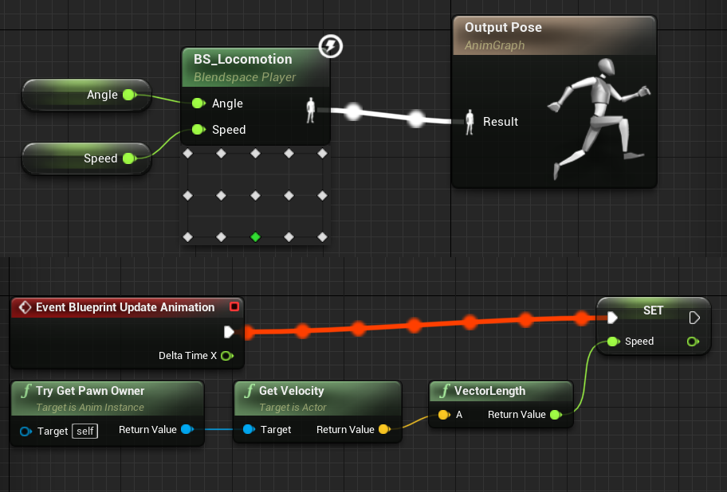
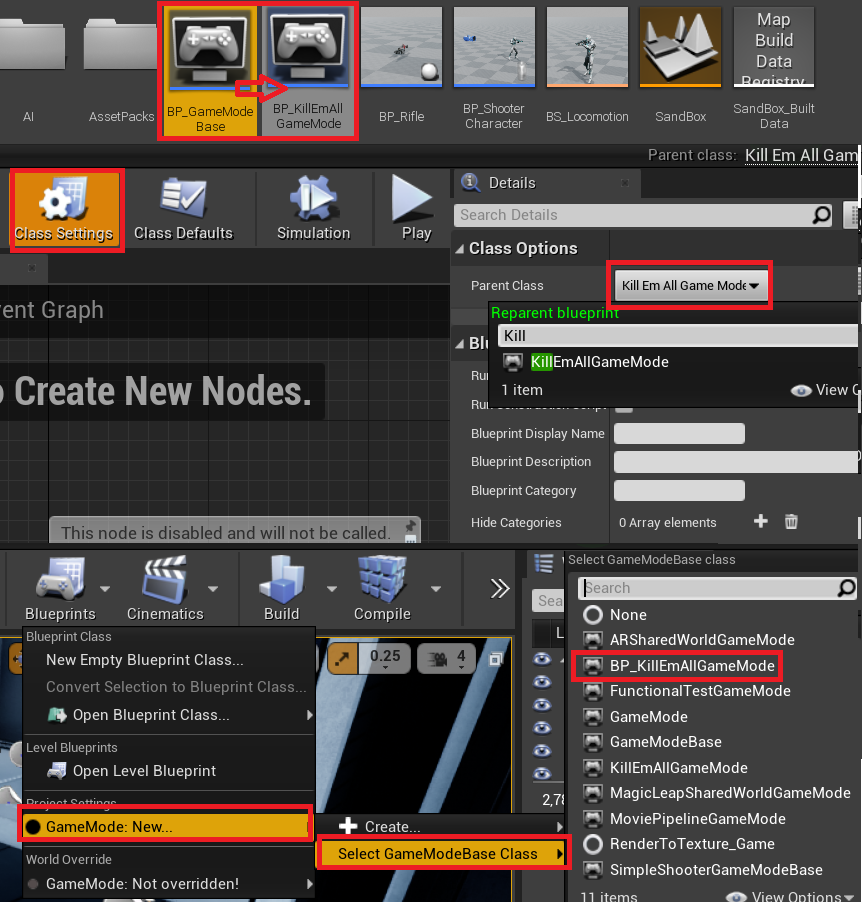
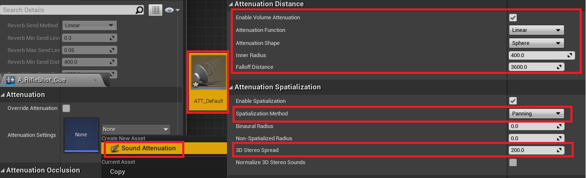

# 1. Pawn VS Character

## Pawn VS Character
Character is inheriting pawn. So it has more speficic feature.
You can see that if you build blue print class, there are far more things are attached in Character class.

and Character also has a lots of function that make your code handy and easy. because of this you don't have to write every code from scrach.


## Create Character
1. Create C++ Character class and deriving BP_version.
2. Attaching Static Mesh, Coordinate with capsule Collider.

## Create duplicated Map
Create Map duplcated from original and Set duplcated Map as a Default map. If you have been messed up or If you want to start from the basic, then the Original Map is neccessary.

## Create BP_GameMode
- Build new BP GameMode. In this time We didn't derived it from c++ . Because we don't needs some c++ functionality. 
Create it and Set the Default Pawn to your BP_version Character.

- In Map and Mode settings, Set this BP_GameMode as a Default GameMode
- You have to care this, this BP_GameMode always needs __PlayerStart__ for Spawning DefaultPawn!

# 2. Inplement Movement
You can see lots of predefine things. If you needs that, vising code file or header file for referencing it.

```c++
	APawn::AddMovementInput();
	APawn::AddMovementInput();
	APawn::AddControllerPitchInput();

    ACharacter::Jump();
```
# 3. Mouse VS Console Controller
It was 168. Controller Aiming.
| Frame | Mouse | Console COntroller |
|-|-|-|
|30F|10-10-10| 1-1-1|
|60F|5 - 5 - 5| 1-1-1|

It causes the problem whenever playing it with console, faster frame makes faster movements. The Interesting is that Only these function has affected on this

```c++
// It affected by frame
AddControllerPitchInput(Value * Rate * GetWorld()->DeltaSeconds);

// It doesn't
AddMovementInput(GetVector()*Value);
```

# 4. Camera Settings


1. Add Spring Arm, Attaching Camera
2. Turn on in Camera Settings-Use Pawn Control Rotation.


3. Instead of Adjusting Camera's Rotation you can set this settings

# 5. Animation
Static Mesh are connected with animation through skeleton. Because it through the skeleton, If using same skeleton on different mesh they can still share the animation.

## Simple Quick Settings


1. BP_Editor, Static Mesh
2. Set Animation Mode to Use Animation Asset
3. Set Anim to Play to your want
4. Check on Looping and Playing
5. Check again your static Mesh.

## A: Set Animation Graph
For far more complicated animation, Animation BluePrint is needed.

Just Watch [172.Animation Blueprints 101](https://www.udemy.com/course/unrealcourse/learn/lecture/20587722) It introduce you how Animation BluePrint works, exactly about Blend!

## B: Set Blend Space
Blend Space is much easier than animation Graph. It supports lots of things.


If those two connectivity between two animation is so different, Then animation going to be tweaked. So Choose the Proper one for fluent motion.

## Hot to Set Animation Blueprint for Blend Space
---
After making Animation Space, your character needs to follow that animation space.

You also want your character's speeds deriveds the animation's change. this is how to set the ABP. Just delete what you don't needs that was done in Section A.




Inverse Transform Direction : Apply Rotation and Scale
Inverse Transform Location  : Move the Position

## Animation - Speed Coordination

1. 

2. 

3. 

|Foot Speed = | (y_finish - y_start) | / | (t_finish - t_start) | 
|-|-|-|-|
|281|(-44.8-25.5) | / |(0.70 - 0.45)|
|115|(-33.5-47.8)| / |(1.41-0.70)|

Roudning to 50. So your Start and End value are 300 and 100. Your division points divided by 50. So. total Points has 350 / 50 = 7.

4. 

5. 

# 6. Set Gun
1. Create C++ Actor class for Gun
2. From 1, Derive BP_Gun to add additional

```c++
	USkeletalMeshComponent* Mesh;
	UStaticMeshComponent* Mesh;
```
Why SkelethalMeshComponent? Istead of UStaticMeshComponent. Because the Asset was made in that way.

## Attaching Gun Mesh to Character's Hand
1. Hiding the Default Gun attaching to Character.
BP_ShooterCharacter -> Mesh -> Skeletal Mesh -> Find the Skeletal's Name

2. Implementing Funcionality of hiding in ShooterCharacter::BeginPlay()
3. Adding Socket's on Mesh


```c++
	GetMesh()->HideBoneByName(TEXT("weapon_R"),EPhysBodyOp::PBO_None);
	Gun->AttachToComponent(GetMesh(), FAttachmentTransformRules::KeepRelativeTransform,TEXT("WeaponSocket"));
	Gun->SetOwner(this);
```
4. Adjusting Location in GamePlay then Copying the location Pasting it on Mesh Location. You can do this on Gun's Mesh Component or WeaponSocket.

- You can do this in the other way is typing code
```c++
Gun->SetActorRelativeLocation(FVector(0.0f, 0.0f, 0.0f));
```
## Scripting for Shooting
1. The Gun has PullTriger works for hitting and Showing Bullets. 

2. ShooterCharacter has TSubclass It works only with Such Class or derived from that.


3. ShooterCharacter has KeyBinding connected intermediate Function for Triggering Gun's PullTriger. AShooterCharacter has It's own Gun Pointer! 

4. You can directly call the Gun's Function in ShooterCharacter. But It will Cause a problem.
```c++
PlayerInputComponent->BindAction(TEXT("Shoot"), EInputEvent::IE_Pressed, Gun, AGun::PullTrigger);
```
Because, The Gun was Spawn in BeginPlay that had been After SetUpPlayerInputComponents. So the Gun Pointer must be null and invalid. You can assign it as you want, but it makes more restrict on your own.

## Spawning Effects for Shooting
In GameplayStatic.h you could find the functionality for spawning Effects.
```c++
SpawnEmitterAtLocation();
SpawnEmitterAttacted();
```


## How to implementing Shooting?
### Using VeiwPort Camera as a Aiming
---
It is more natural your aiming is followed by viewport camera instead of guns that keep moving with animation.
For that We would use below on 'Gun.cpp'
```c++ 
#include "DrawDebugHelpers.h"
ENGINE_API void DrawDebugCamera(const UWorld* InWorld, FVector const& Location, FRotator const& Rotation, float FOVDeg);
```

### LineTracing
Ctrl + 'P' , Searching World.h, 
Ctrl + 'P' , Typing @ and searching LineTraceTest,

```c++
LineTraceTestByObjectType();
LineTraceTestByChannel();
```
Using ObjectType didn't has a option for false hitting, So Channel is Better way of marking both hit or unhit. this Channel way is choose whether the actor is tranparent or not.

At this point You have to edit Project Settings for Engine Collision. 


You can think the bush you can see that allow tranparenting bullet and overlapping its mesh.


```c++
World.h -> LineTraceTestByChannel() -> F12 on ECollisionChannel
ECC_GameTraceChannel1
ECC_GameTraceChannel2
ECC_GameTraceChannel3
...

```
For figuring out which ECC_GameTraceChannel is which, you have to visiting this file.
File : __Config\DefaultEditor.ini__

and now you can use it in a code.


After Implemnting 
```c++
void AGun::PullTrigger() 
{
	if( bSuccess)
	{
		...
	}

}
```


## Receving Damage and Sending Damages
For testing, Spawning BP_Character on the Scene. You can see TakeDamage on Actor.h. there are two types of Damage defined internally as a standard(You can define your custom).
```c++
Actor::TakeDamage();
EngineTypes::FRadialDamageParams // Gerenade
EngineTypes::FPointDamageEvent // Bullet
```

- Short for Difference ApplyDamage in ToonTanks
The only real difference is that ApplyDamage sets up a damage event for you before calling TakeDamage on the Actor.

### Implementing TakeDamage with overriding
For Calculating Damage, Implementing TakeDamage on AShooterCharacter.
```c++
AShooterCharacter::TakeDamage()
{

}
```
You can implementing Damaging function not only in Actor but also in actor components. If you implemnting this as a components, you can reuse it in the other way.

- Min method was defined in FGenericPlatformMath::Min
## Add Death Animation


For Connecting these blueprint process to code, you needs to decelare
```c++
UFUNCTION(BlueprintCallable)
UFUNCTION(BlueprintPure)
bool AShooterCharacter::IsDead() const; // 'const', so this function make no modification.
```

BlueprintPure didn't change anything such like a const.


Set ABP_ShooterCharacter in this way. You have to cast PawnOwner to ShooterCharacter which is C++ Class for using IsDead Function.


# 7. Add AI
## Create Tools for AI

1. Create C++ AI Controller
2. Create BP version derived from C++ AI Controller
3. Set your BP Character's Pawn Settings to BP_AI Controller

## Implementing
Before dive into the code, just look around AIController.h. That header has a lot of function help you to implement your own AI.
```c++
	// Focusing Point Exact for Fixed Objects or Location.
	virtual void SetFocalPoint(FVector NewFocus);

	// Focusing actor
	virtual void SetFocus(AActor* NewFocus);

	// Clears Focus for given priority, will also clear FocalPoint as a result
	virtual void ClearFocus(EAIFocusPriority::Type InPriority);
	// Enum Variables indicates which one is first
	EAIFocusPriority::Type InPriority
```
If you find __BeginPlay__ in AIControll.h, It was located in __protected__ so you needs to implement with that and also adds __overrides__.


## Set AI Navigation Mesh

1. Create __Nav Mesh Bounds Volume__ touching Ground
2. Turn on Show's Navigation
3. Adjust brush Settings.
4. Implementing Stop the AI when Player is on out of sight
```c++
	virtual bool LineOfSightTo(const AActor* Other, FVector ViewPoint = FVector(ForceInit), bool bAlternateChecks = false) const override;
```

## Create Behavior Tree and Black Board

1. Create BehaviorTree, Blackboard
- BlackBoard is for property saving variable used in Behavior Tree
- you can check condition which state the AI is belonged to.

2. In BP_ShooterCharacter, Set AIBehavior to Behavior Tree.


3. these two name should has to be same
- The Sequence has it's own order. If one of branch fail, then maybe, the whole sequence would fail either.
- After Complete the Whole Sequence, Came back to Root, and do the same thing again.

## Refactoring Behavior Tree 1

1. Add Decorator for check the condition.

2. Observer aborts has three option, choose one of them.
None : After Completing all the processs, check condition again.
Both : Checking Every time, and execute the function following the condition.

- You can changing the speed of AI Robot in CharacterMovement -> CharacterMovement:Walking -> Max Walk Speed

## Refactoring Behavior Tree 2

1. Create BTTask_BlackboardBase for Adding another condition on the behavior tree.

2. Because Editor has some errors, you have to type __"GamePlayTasks"__ in SimpleShooter.Build.cs manually

3. Create Constructor
```c++
UBTTask_ClearBlackboardValue::UBTTask_ClearBlackboardValue() 
{
    NodeName = TEXT("Clear Blackboard Value");
}
```


4. branching that C++ class in the Behavior Tree

5. implementing ClearBlackBoardValue.cpp
```c++
	/* 
	Visiting Parent Class and find ExecuteTask we want to implementing.
	include this on header, and implementing on code file.
	*/
	virtual EBTNodeResult::Type ExecuteTask(UBehaviorTreeComponent& OwnerComp, uint8* NodeMemory);
```
6. Add "Move to" branching out of selector.

- UBTTask_ClearBlackboardValue -> UBTTask_BlackboardBase -> UBTNode
then you can see some information
- { ExecuteTask, AbortTask, TickTask, OnMessage }

- Check Has Investigated's aborts is set to None.

## Refactoring Behavior Tree: Add Shooting

1. Create BTTaskNode.
2. Implementing Constructor and ExecuteTask
```c++
	UBTTask_Shoot(); // Essentialy you have to assign name value on NodeName.
	virtual EBTNodeResult::Type ExecuteTask(UBehaviorTreeComponent& OwnerComp, uint8* NodeMemory);
```
3. Add Sequence with Loop set infinite.
4. Branching that out from the Sequence.


## Refactoring Behavior Tree: Use BT_Service
Instead of Updating Blackboard's Propery in AIController, Just Do that things in BTService.
- It would be display the detail on Behavior trees. 
- Only do the certain things ( Updating LastSeenLocation while chasing)
- It's more effective call BT_Service's Tick that ticks every 0.4, instead of AIController's Tick that ticks every frame.


1. Create Two BTService_BlackboardBase
2. Implement Constructor and TickNode
3. Delete Updating functionality in AIController, Implementing That on Each BTService_BlackboardBase
4. Branching out form Original
5. Set BlackboardKey

# 8. Fixing bug

## Fixing Killing itself
- The Gun get the job of shooting. The problem is that Lay tracing starts from the eyes, and hit the capsule collider immediately, parts of the character. So editting Gun.cpp
```c++
	void AGun::PullTrigger()
	{
		FCollisionQueryParams Params;
		Params.AddIgnoredActor();
	}
```

## Disable the Controller and Collider when Player is dead
```c++
	float AShooterCharacter::TakeDamage() 
	{
		if(IsDead())
		{
			DetachFromControllerPendingDestroy();
			GetCapsuleComponent()->SetCollisionEnabled(ECollisionEnabled::NoCollision);
		}
	}	
```

# 9. Set GameMode
## Diagram
PlayerController implicit has GameHasEnded() for checking wheter the game is end. You can inherit this function and use it for game over or win.
```cpp
ShooterPawn -> GameModeBase
			  KillEmAllGameMode -> PlayerController
			  					   ShooterPlayerController
			virtual PawnKilled()	virtual GameHasEnded()
```
this diagram show how the game over is working.

## Step 1
1. implementing empty PawnKilled() on "SimpleShooterGameModeBase"
2. Create derived c++ class and inheriting Pawnkilled and implementing the functionality
```c++
	// SimpleShooterGameModeBase.h
	virtual void PawnKilled(APawn* PawnKilled);
	// Create Dervied class from SimpleShooterGameMode Base
	// Called KillEmAllGameMode
	virtual void PawnKilled(APawn* PawnKilled) override;
```
3. Initialize GameMode variable in ShooterCharacter::TakeDamege. and call PawnKilled
```c++
	float AShooterCharacter::TakeDamage() 
	{
		if(IsDead())
		{
			// This should have to be located front of DetachFromControllerPendingDestroy
			// So later Pawn killed will not meet the situation that controller is always nullptr
			ASimpleShooterGameModeBase *GameMode = GetWorld()->GetAuthGameMode<ASimpleShooterGameModeBase>();
			if(GameMode != nullptr){ GameMode->PawnKilled(this); }

			DetachFromControllerPendingDestroy();
		}
	}	
```


4. Change The Name of BP_GameModeBase to BP_KillEmAllGameModeBase

5. Set Parent Class to C++ KillEmAllGameMode

6. Select GameModeBase to BP_KillEmAllGameModeBase


- You can do that with event dispatchers, event-driven approach for informing GameMode about dead pawn. If you are interest, try it.

## Step 2

1. Implementing Pawn Killed in KillEmAllGameMode.h for GameHasEnded

```c++
// KillEmAllGameMode
void AKillEmAllGameMode::PawnKilled(APawn* PawnKilled) 
{
    if (PlayerController != nullptr)
    {
        PlayerController->GameHasEnded(nullptr, false);
    }
}
```
- Then You needs actual class for implementing GameHasEnded inheriting from parents.

2. Create C++ Player Controller

3. Create BP verision of Player Controller derived from C++. This is also for UI hooking up this BP_PlayerController

4. Set Player Controller to BP_ShooterPlayerController on BP Editor


## Step 3. Looping Game
- Implementing GameHasEnded with TimerHandle for waiting for looping the Game
```c++
void AShooterPlayerController::GameHasEnded(class AActor* EndGameFocus, bool bIsWinner) 
{
    GetWorldTimerManager().SetTimer(RestartTimer, this, &APlayerController::RestartLevel, RestartDelay);
}
```

# 10. Create UI
If you didn't have a intention to add a logic in UI, Just use BP version. It is much easier.
So We are Creating UI on BP and Spawn that on C++

1. Create Widget BluePrint Categorized in User Interface

2. Editing UI

3. Implementing Code
- Create TSubclassOf for restricting the Class, and assign the UUSerWidget Type, for Spawning Widget BP
```c++
	// ShooterPlayerController.h
	TSubclassOf<class UUserWidget> LoseScreenClass;

	// SimpleShooter.Build.cs
	// because vscode didn't include all the library in auto
	// so if you needs Blueprint things then modifying this. 
	PublicDependencyModuleNames.AddRange(new string[] 
	{ "Core", "CoreUObject", "Engine", "InputCore", "GamePlayTasks", "UMG" }); // Just Add "UMG"
	
	// ShooterPlayerController.cpp
	#include "Blueprint/UserWidget.h" // For this You have to modifying SimpleShooter.Build.cs

	void AShooterPlayerController::GameHasEnded(class AActor* EndGameFocus, bool bIsWinner) 
	{
		// UserWidget::CreateWidget
		// 'this' = Controller because the Owner is this.
		UUserWidget* LoseScreen = CreateWidget(this,LoseScreenClass);

		// and then you can add this Widget on ViewPort for showing UI
		if(LoseScreen != nullptr)
		{
			LoseScreen->AddToViewport();
		}
	}
```
- You can see That module dependency

4. Go to the BP_PlayerController, Set the TSubclassOf "LoseScreenClass" to WBP what you spawn on viewport.

# 11. Death Functionality
- You can Check Every Pawn->IsDead in the AKillEmAllGameMode. But that is Quite un Expandable.
If you have a any plan to extend the Level, Approch this from via Controller is much reasonable.
If AI Unit has Different type of Pawn, this Problem would be much harder to solve the case you just iterate all the pawn in GameMode.

```c++
void AKillEmAllGameMode::EndGame(IsPlayerWinner) 
{
    // TActorRange Return Iterator of exact type in the World(Level)
    for(AController* Controller : TActorRange<AController>(GetWorld()) )
    {
        bool bIsWinner = Controller->IsPlayerController() == IsPlayerWinner;
        Controller->GameHasEnded(Controller->GetPawn(), bIsWinner);
    }
}
```
1. Use TActorRange for Iterate exact class in the Level.
2. Check the Condition below and Lose If Controller is AI and Player Lose.
3. Replacing PawnKilled with this.

4. Implementing IsDead on ShooterAIController
```c++
bool AShooterAIController::IsDead() const
{
    AShooterCharacter *ControlledCharacter = Cast<AShooterCharacter>(GetPawn());
    if(ControlledCharacter != nullptr)
    {
        return ControlledCharacter->IsDead();
    }
    // The Controller is Detached when Pawn is dead
    return true;
}
```

5. Refactoring ShooterPlayerController::GameHasEnded();
```c++
// ShooterPlayerController.h
UPROPERTY(EditAnywhere)
TSubclassOf<class UUserWidget> WinScreenClass;

// ShooterPlayerController.cpp
void AShooterPlayerController::GameHasEnded(class AActor* EndGameFocus, bool bIsWinner) 
{
    if(bIsWinner)
    {
        UUserWidget* WinScreen = CreateWidget(this,WinScreenClass);
        if(WinScreen != nullptr){ WinScreen->AddToViewport(); }
    }
    else
    {
        UUserWidget* LoseScreen = CreateWidget(this,LoseScreenClass);
        if(LoseScreen != nullptr){ LoseScreen->AddToViewport(); }
    }
}
```
6. Duplicates WBP_LoseScreen and Make WBP_WinScreen
7. Assign Class in BP_ShooterPlayerController
8. Implementing Win Condition On KillEmAllGameMode
```c++
void AKillEmAllGameMode::PawnKilled(APawn* PawnKilled) 
{
    for(AShooterAIController *Controller : TActorRange<AShooterAIController>(GetWorld()) )
    {
        if( !Controller->IsDead() )
        {
            return;
        }
    }
    EndGame(true);
}
```

# 12. Refactoring Pull Trigger
- Because PullTrigger is So messy, Its quite hard to add audio functionality. So before adding that Just Refactor this for more readability.
```c++
void AGun::PullTrigger() 
bool AGun::GunTrace(FHitResult &Hit, FVector &ShotDirection) 
AController* AGun::GetOwnerController() const
```

# 13. Add Audio
## Implementing Audio
```c++
	// Gun.h
	USoundBase* MuzzleSound;
	USoundBase* ImpactSound;

	// Gun.cpp  - PullTrigger() 
	UGameplayStatics::SpawnSoundAtLocation(GetWorld(), ImpactSound, Hit.Location);
	UGameplayStatics::SpawnSoundAttached(MuzzleSound, Mesh, TEXT("MuzzleFlashSocket"));
```
 1. Implementing Code on PullTrigger
 2. Set MuzzleSound and impactSound on BP_Rifle
## Randomize Audio Sound

1. Create SoundCue
2. Choose Multiple SoundWave(SoundBase)
3. Right Click on Cue, Choose Random
4. without Replacement choose - cycling the whole list randomly
5. Add Modulator
6. Set BP_Rifle's Sound Setting to those Cues.

## PlaySound VS SpawnSound
[QnA](https://answers.unrealengine.com/questions/428907/different-ways-to-play-a-sound.html)

## Spatialization
- You can make sound more dynamically using Attenuation Settings. It is so useful. You can apply a one Attenuation on all Cue. It is Scalable.


1. Create Attenuation and adjust the setting you want.

| Name |  Description|
|-|-|
|Attenuation Shape| How to adjust Sound volum as an object gets further away.|
|Inner Radius| The Location Max Sound Volume heared.|
|Falloff Distance| further than this distance makes no sounds.|

| Name | Description | 
|-|-|
|Spatiallization Method| Panning - discriminate left and right Binaural - also up and down|
|3D Stereo Spread| Adjusting Volume related to distance.|


# 14. Add CrossHairs and HUD
1. Create UI Widget BluePrint
2. Implementing Code on ShooterPlayerController
```c++
	// ShooterPlayerController.h
	TSubclassOf<class UUserWidget> HUDClass;
    UUserWidget* HUD;

	// ShooterPlayerController.cpp
	void AShooterPlayerController::BeginPlay() 
	{
		HUD = CreateWidget(this,HUDClass);
		if(HUD != nullptr)
		{
			HUD->AddToViewport();
		}
	}
	void AShooterPlayerController::GameHasEnded() 
	{
		HUD->RemoveFromViewport();
	}
```
## Extra contents for this
[UMG Practice on GameDev](https://blog.gamedev.tv/creating-unreal-engine-ui-with-umg-and-c/)

[UMG Practice on EpicGames](https://www.unrealengine.com/en-US/tech-blog/umg-best-practices)

# 15. Adding HP Bar
1. Implementing tools for Health bar
```c++
	// ShooterCharacter.h
	UFUNCTION(BlueprintPure)
	float GetHealthPercent() const;
```
2. Add Progress Bar on HUD

3. Biding Progress with BP Script


4. To call the tools we implement in 1, Find ShooterCharacter and Call that Method

- This HUD is Belong to PlayerController. We Get it's belonging Pawn first, and Cast it to ShooterCharacter for using the function implmented in inherited class.

## Differentiate Enemy and Player
1. Duplicates BP_Character then all the settings is same but different BP_Character is Intanced. 
2. Applying Different Mesh, Set the health higher than Enemy.
3. Go into the BP_GameMode, Choose Default Pawn Class to What you duplicate from original.

# 16. Set Aim Offset
## Set Anim Graph

1. Dive into the ABP_ShooterCharacter.
2. In AssetBrowser, Searching Idle_AO_Combat
- Ide_AO_Combat is Additive Animation, You can Add this Animation on other Animation That is Why this called Additive.

3. Create this on Anim Graph
4. Promote Pitch Value.

## Refactor Event Graph
- If you add IsValid came from Pawn You can see Preview of it. If you didn't every of those overwrited with 0 by Anim Graph, So you can see the preview is stopping.


1. Create Sequence
2. Replace Cast To ShooterCharacter, Set, IsDead then Connecting this bundle to sequence.
3. Get Control Rotation and GetActorRotation from Pawn
4. Get local varible trough subtraction between Control Rotation and Actor Rotation.
- Why We do that? 
Control Rotation pitch will only produces values from 0 - 360 which isn't going to work when you look down. and it also didn't account what you are facing. So you need to subtract the actor's rotation.

5. Get only Pitch Value and Set Aim Pitch defined in Anim Graph.

## Refactor BT_Enemy

- It's Time to adjust AimOffset for AI
1. Change PlayerLocation Vector to Player Object(Actor)
2. Change every of node to Player Actor
3. Refactoring Code in BTService_PlayerLocationIfSeen.cpp

```c++
	// BTService_PlayerLocationIfSeen.cpp
	// Before
    OwnerComp.GetBlackboardComponent()->SetValueAsVector(GetSelectedBlackboardKey(), PlayerPawn->GetActorLocation());

	// After
	OwnerComp.GetBlackboardComponent()->SetValueAsObject(GetSelectedBlackboardKey(), PlayerPawn);
```


# 17. Jump! State Machine
## Create State Machine

1. Create State Machine
2. Add Two States One
3. move Locomotion into the Grounded state
4. Add Airborne Animation, Set off Loop Animation 
5. Add Logic Between Two states using new variable called IsAirBorne

## Add Variable for Jump

1. Cast Pawn to Character
2. Use Function IsFalling made already by unreal
3. Set AirBorne variable

## Refactoring State Machine

- For more natrual Movement, Just add Jumping and Landing Animation.
1. Add Jumping and Landing state.
2. Connect each state
3. the Outer Logic for Jumping and Landing needs to set __"automatic rule based on sequence player in state"__
- This Option allow you that just after executing the last state, move to the Next state right away.

4. Set Mode to any option
- If you find weird in transition between state, So animation is looked awkward, then change this option. 
- You try many option, And choose one of those for more natrual movement animation

## Nesting State Machine

You can make the Anim graph more simple
1. Create State Machine
2. Add Two State, Alive and Death.
3. Put Alive animation Logics into the Alive state
4. Put Dead animation into the Death state
5. Connect IsDead to OutputPose

# 18. Add Music

## Background music

1. Spawn Ambient Sound on World
- Where to Spawn is not matter, Just Spawn wherever.
2. Choose the sound you want.

## Intro Sound
1. Go to BP_ShooterPlayer
2. Go to Event Graph
3. In BeginPlay, Create new Node "Play Sound at Location"
4. Set location to actor's location

# Tips
## VSCode Short Cut
|ShortCut|Description|
|----|----|
F12 | Seraching Delcat
Ctrl + 'P' | for Searching File
Alt + 'O'| for Swtiching header / Code file

## How to find Header File?

1. CTRL + 'P'
2. Type the file you want

## UE4 Short Cut

 [Syntax Reference](https://docs.unrealengine.com/4.27/en-US/Basics/ContentBrowser/AdvancedSearchSyntax/)
- You can search assets using 'End-with' text like { idle "combat" }

## All information about Dynamic Casting
[learncpp.com](https://www.learncpp.com/cpp-tutorial/dynamic-casting/)


## Virtual Methods
```c++
class Gun{
	void Shooting(){ std::cout << "Bang!" << std::endl; }
};
class Pistol : public Gun{
	void Shooting(){ std::cout << "Pew!" << std::endl; }
};
int main(){
	Pistol P;
	Gun* GPtr = &P;
	// If not explicitly declare 'virtual' then using Gun's Method.
	// Output = Bang! // Compiler finds the effective way.
	P->Shooting();
}
// Modifing Gun class to this
class Gun{
	virtual void Shooting(){ std::cout << "Bang!" << std::endl; }
}
int main(){
	Pistol P;
	Gun* GPtr = &P;
	// If not explicitly declare 'virtual' then using Gun's Method.
	// Output = Pew! // Compiler catching virtual, instead of that using inheritanced methods for upcasting object.
	P->Shooting();
}
```
If you add __'override'__ on inherited methods, it just check whether spelling is same as virtual. It is additional you don't have to use it, but is for safey matter.


# Challenges
## How to have different particle effects based on what the player has hit?
create a physics material and use that on the different types. You would then use that to determine what effects to play, the physics material that the hit actor has is in the FHitResult of a line trace.

You are trying to check whether a pointer is equal to PM_ShallowWater which was never declared anywhere.

Hit.PhysMaterial is a weak pointer and not convertible to bool so you need to use IsValid on it. You would check if its name or surface
```c++
const bool bHasPhysMaterial = Hit.PhysMaterial.IsValid();
if (bSuccess && bHasPhysMaterial && Hit.PhysMaterial->GetName() == TEXT("PM_ShallowWater"))
{
}
// Or if you go into your project settings and add a surface type under Physics
const bool bHasPhysMaterial = Hit.PhysMaterial.IsValid();
if (bSuccess && bHasPhysMaterial)
{
    switch(Hit.PhysMaterial->SurfaceType)
    {
    case SurfaceType_Default:
        //do default stuff
    case SurfaceType1:
        //do SurfaceType1 stuff
    }
}
// Though I would recommend creating your own enum for better names e.g.

enum ESurfaceType
{
    Metal = SurfaceType1
};
//After testing I've found out you also need to use FCollisionQueryParams with bReturnPhysicalMaterial enabled

FCollisionQueryParams Params;
Params.bReturnPhysicalMaterial = true;
FHitResult Hit;
bool bSuccess = GetWorld()->LineTraceSingleByChannel(Hit, Location, End, ECollisionChannel::ECC_GameTraceChannel1, Params);
```

## Include Problem
[The reason we include BlackboardComponent.h](https://www.udemy.com/course/unrealcourse/learn/lecture/20628352#questions/12289538)


## Dynamic Dispatching
- dynamic dispatch is the process of selecting which implementation of a polymorphic operation (method or function) to call at run time. Polymorphism is the phenomenon wherein somewhat interchangeable objects each expose an operation of the same name but possibly differing in behavior.
```c++
#include <iostream>
struct ABase
{
    virtual void Foo() const{ std::cout << "Base::Foo() called\n"; }
};
struct ATurret : ABase
{
    virtual void Foo() const override{ std::cout << "I am a Turret!\n"; }
};
struct ATank : ABase
{
    virtual void Foo() const override{ std::cout << "I am a TANK!!\n"; }
};

void Bar(const ABase& B){ B.Foo(); }

int main()
{
    ATurret Turret;
    ATank Tank;    
    
    Bar(Turret);
    Bar(Tank);
}
```
-  the game mode is KillEmAllGameMode, so when PawnKilled is called from ASimpleShooterGameModeBase* GameMode it will dispatch to KillEmAllGameMode::PawnKilled

Having a virtual function and casting to the base class allows you to have differing implementations of the same function but called dynamically at runtime.

For example if you want to create another gamemode like a time attack and want to score points for killing pawns based on time elapsed. All you need to do there is create another class derived from ASimpleShooterGameModeBase and override PawnKilled, and implement that scoring there, you don't have to change the implementation of TakeDamage at all.

[How does GetAuthGameMode call the child KillEmAllGameMode::PawnKilled() method](https://www.udemy.com/course/unrealcourse/learn/lecture/20628412#questions/11933680)