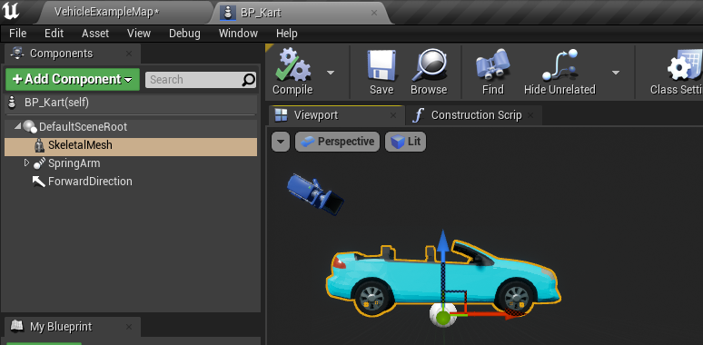
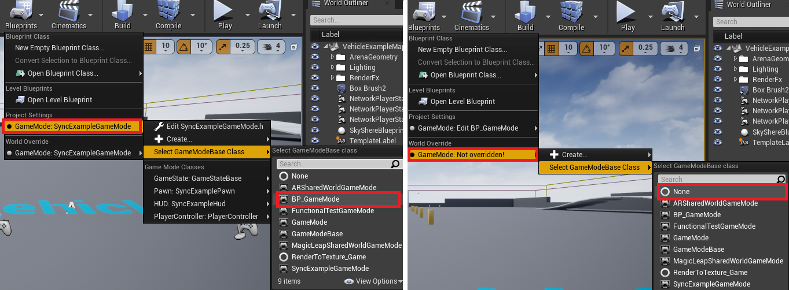
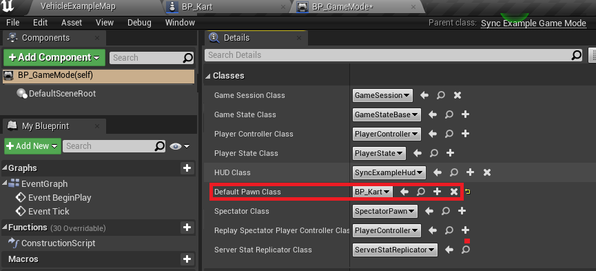
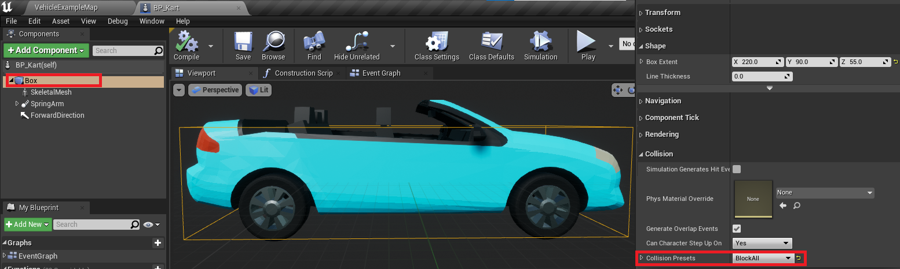
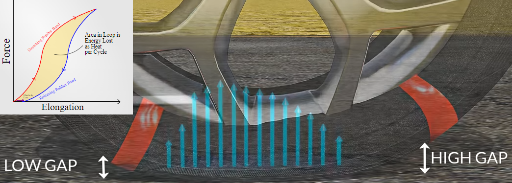
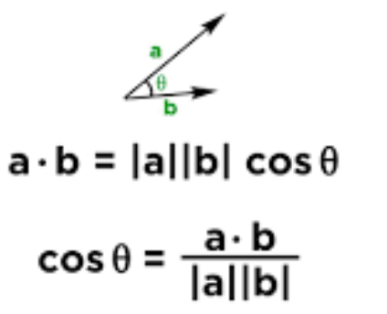

# 1. Creating A Go-Kart Pawn #
1. Create C++ Pawn and Creating BP inheriting C++ Pawn
2. Editing BP Pawn


3. Create BP GameMode Inheriting Default C++ GameMode
4. Set Project Settings GameMode



5. Implemeting Movement Logic for Car
```c++
AKart::AKart()
{
	Speed = 1000.f;
}

void AKart::Tick(float DeltaTime)
{
	Super::Tick(DeltaTime);
	FVector LocationToMove = Velocity * Speed * DeltaTime;
	AddActorWorldOffset(LocationToMove);
}

void AKart::SetupPlayerInputComponent(UInputComponent* PlayerInputComponent)
{
	Super::SetupPlayerInputComponent(PlayerInputComponent);
	InputComponent->BindAxis(FName("MoveForward"), this, &AKart::MoveForward);
}

void AKart::MoveForward(float Value)
{
	Velocity = Value * GetActorForwardVector();
}
```

# 2 Understanding Forces And Movement #
## How to Simulate Physics?
1. Transition is Accumulating Velocity with Time. So 
	- __Transition = Velocity * Time__
2. Velocity is Acculating Acceleration with Time. So
	- __Velocity = Acceleration * Time__
3. You can take Acceleration with Force, How many Power is pushing the Mass
	- __Acceleration = Power / Mass__

## Get the Equation for Calculate
|Transition = |Velocity * Time|
|-|-|
|Transition = |Acceleration * Time * Time|
|Transition = |Power/Mass * Time * Time|


## Implementing in on Code
```c++
void AKart::Tick(float DeltaTime)
{
	// Acceleration = Delta Velocity / Delta Time
	FVector Force = GetActorForwardVector() * Throttle * MaxDrivingForce;

	// (a = F / m) == (F = m * a)
	FVector Acceleration = Force / Mass;
	
	// Acceleration = Delta Velocity / Delta Time
	// acceleration is the change in speed divided by change in time
	Velocity += Acceleration * DeltaTime;

	float TransRealWorldUnit= 100.f;
	// (Transition = Velocity * Time) == (Velocity = Delta transition / Delta Time)
	FVector Translation = Velocity * DeltaTime * TransRealWorldUnit; // 
	AddActorWorldOffset(Translation);
}
```

# 3 Blocking Movement Without Physics #
## Setting up collision volumes.


## Sweeping with `AddActorWorldOffset`.
1. Turn On bSweep for Working Collision
2. Check blocking with FHitResult.

```c++
void AKart::Tick(float DeltaTime)
{
	FHitResult HitResult;
	/*@param bSweep  Whether we sweep to the destination location, triggering overlaps along the way and stopping short of 
	 *				 the target if blocked by something.Only the root component is sweptand checked for blocking collision, 
	 *				 child components move without sweeping.If collision is off, this has no effect. */
	AddActorWorldOffset(Translation, true, &HitResult);
	if (HitResult.IsValidBlockingHit()) {
		Velocity = FVector(0.f);
	}
}
```

# 4 Rotations With Quaternions #
## Angle axis rotations with FQuat.


## Adding rotations actors.
1. Set Rotation Angle Degree
2. Get FQuat Rotation with Upwards Direction and transform it into radians. 
3. Applying Rotation info to Actor
```c++
void AKart::Tick(float DeltaTime)
{
	// Rotation Angle is Degree , RotationDelta takes Radians
	float RotationAngle = MaxRotatingForce * DeltaTime * SteeringThrow;
	FQuat RotationDelta(GetActorUpVector(), FMath::DegreesToRadians(RotationAngle));

	Velocity = RotationDelta.RotateVector(Velocity);
	AddActorWorldRotation(RotationDelta);
}
```

## Rotating our velocity.
# 5 Simulating Air Resistance #
## Understanding air resistance.


## Calculating force due to air resistance.
- AirResistance Affecting Force relating to Movement
```c++
FVector AKart::GetAirResistance()
{
	//Velocity.SizeSquared() == FMath::Square(Velocity.Size());
	FVector AirResistance = Velocity.GetSafeNormal() * Velocity.SizeSquared() * DragCoefficient;
	return -1 * AirResistance;
}

void AKart::Tick(float DeltaTime)
{
	FVector Force = GetActorForwardVector() * Throttle * MaxDrivingForce;
	
	/* Modified */
	Force += GetAirResistance();

	FVector Acceleration = Force / Mass;
}
```
# 6 Simulating Rolling Resistance #
## What is rolling resistance?


- Rolling Resistance = RR Coefficient * Normal Force
- [Explanation About Rolling Resistance](https://www.youtube.com/watch?v=_S2lyaMgBQ8)


## Implementing Rolling Resistance
1. Finding the gravity in Unreal.
2. Implementing rolling resistance.
3. Example rolling resistance coeffients. 
```c++
FVector AKart::GetRollingResistance()
{
	// GetGravityZ = -980.f, default unit is centimeter
	float ReactingGravityForce = -1 * GetWorld()->GetGravityZ() / TransUnit;

	float NormalForce = Mass * ReactingGravityForce;
	
	return -1 * Velocity.GetSafeNormal() * RollingResistanceCoefficient * NormalForce;
}

void AKart::Tick(float DeltaTime)
{
	FVector Force = GetActorForwardVector() * Throttle * MaxDrivingForce;
	Force += GetAirResistance();

	/* Add Rolling Resistance */
	Force += GetRollingResistance();

	FVector Acceleration = Force / Mass;
}
```
# 7 Steering And Turning Circles #
## Why we get turning circles Calculating our rotation geometry.


# Usage for Dot Product

- Dot Product is useful, when calculating Cosines Theta btw two vector
- By using this Calculating Degrees or radians btw two Vector


## Correcting steering behaviour.
```c++
void AKart::Tick(float DeltaTime)
{
/* Rotation */
	// Rotation Angle is Degree , RotationDelta takes Radians
	float DeltaLocation = FVector::DotProduct(GetActorForwardVector(), Velocity) * DeltaTime;
	float RotationAngle = DeltaLocation / TurningRadius * SteeringThrow;
	FQuat RotationDelta(GetActorUpVector(), RotationAngle);

	Velocity = RotationDelta.RotateVector(Velocity);
	AddActorWorldRotation(RotationDelta);
}
```
- [Physics for Advanced Racing Game, like Drafting](https://www.udemy.com/course/unrealmultiplayer/learn/lecture/8274656#questions/12231310)

- [How to implement exact Physics?](https://www.udemy.com/course/unrealmultiplayer/learn/lecture/8274656#questions/10831926)


# 8 Server Functions & Cheat Protection #
## How to change state from the client.
## Introduction to RPC server functions.
## What is validation?
## Implementing validation for input.
# 9 AutonomousProxy vs SimulatedProxy #
## What are Actor roles?
## Investigating the network roles.
## Updating the `AutonomousProxy`.
# 10 Sources Of Simulation Error #
## How simulation error effect our game.
## Overview the different sources of error.
## Investigate approaches to eliminating them.
# 11 Replicating Variables From The Server #
## Overview of property replication.
## Replicating the actor position.
## Setting and reading the property.
## Replicating the actor rotation.
# 12 Triggering Code On Replication #
## Deep dive on property replication.
## Setting the network update interval.
## Notify on replicate.
## Simulate between updates.
# 13 Smooth Simulated Proxies #
## Replicating velocity.
## Why is movement jerky?
## Replicating control input to SimulatedProxy.
# 14 Simulating Lag And Packet Loss #
## What is lag?
## Simulating lag and packet loss.
## Why does lag cause glitching?
# 15 Replay Autonomous Moves #
## Why do we reset when accelerating?
## Keeping AutonomousProxy ahead of the Server.
## What information needs to be sent to the server.
## Compare our different simulation approaches.
# 16 Planning Client-Side Prediction #
## Pseudocode for client prediction.
## Adding structs for synchronisation.
# 17 Replicating Structs #
## What do we have already?
## Replicating state via a struct.
## Sending the `Move` struct via RPC.
# 18 Simulating A Move #
## The `SimulateMove` signature.
## Updating the canonical state.
## Implement `SimulateMove`.
# 19 Unacknowledged Move Queue #
## `TArray` for the Move queue.
## Tidying the move creation code.
## Printing the queue length.
## Removing acknowledged moves.
# 20 Simulating Unacknowledged Moves #
## Simulate all moves.
## Testing for smoothness.
## How can we still make it glitch?
# 21 Fixing SimulatedProxy Prediction #
## Ensuring the Server simulates once.
## Local prediction on the client.
## Making smoother predictions.
# 22 Refactoring Into Components #
## Red-Green-Refactor process.
## How to spot your "code smells".
## Identifying a suitable refactor.
## Planning our refactor.
# 23 Extracting A Movement Component #
## Create and name the component.
## Move member declarations across.
## Move function implementations.
## Fix build errors.
# 24 Extracting A Replication Component #
## Creating the component.
## Enable replication.
## Move member declarations across.
## Move function implementations.
## Fix build errors.
# 25 Decoupling Movement & Replication #
## What happens if we disable the replicator?
## Allow the Movement Component to tick.
## Getting the information to replicate.
# 26 Linear Interpolation For Position #
## How does linear interpolation work?
## Overview of client interpolation.
## Pseudocode for client interpolation.
# 27 FMath::Lerp For Client Interpolation #
## Ensure movement replication is off.
## Updating the time variables.
## `FMath::Lerp` vs `FMath::LerpStable`.
## Implementing the pseudocode.
# 28 FQuat::Slerp For Rotation #
## `Slerp` vs `Lerp`.
## Store tranform instead of location.
## Implementing `Slerp`ed location.
# 29 Hermite Cubic Spline Interpolation #
## Understanding jarring movement.
## How velocity can help or hinder.
## A brief overview of polynomials.
## Introducing the Hermite Cubic Spline.
# 30 FMath::CubicInterp For Velocity #
## Slopes, derivatives and velocity.
## Using `CubicInterp` for location.
## Using `CubicInterpDerivative` for velocity.
# 31 Refactoring With Structs #
## Assessing the existing code.
## Creating a plain C#### struct.
## Pulling out methods.
# 32 Client Interpolation Mesh Offset ##

## Understanding mesh offseting.
## Set up the mesh offset root component.
## Manipulating the offset instead.

# 33 Advanced Cheat Protection #

## Bounding the inputs.
## Stressing our DeltaTime.
## Tracking simulation time.