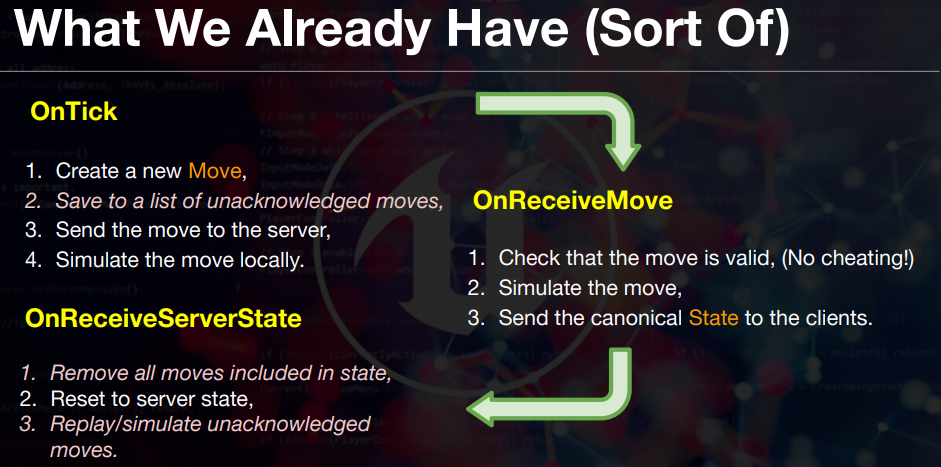
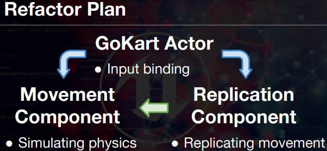
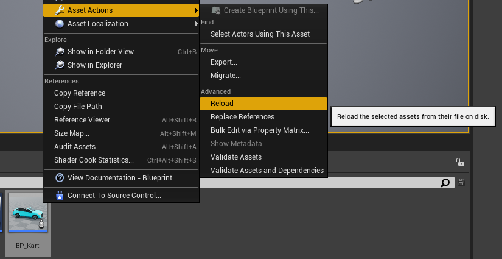
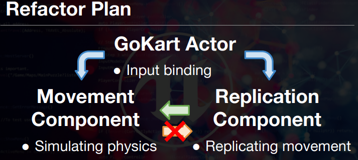

# 1. Creating A Go-Kart Pawn #
1. Create C++ Pawn and Creating BP inheriting C++ Pawn
2. Editing BP Pawn


3. Create BP GameMode Inheriting Default C++ GameMode
4. Set Project Settings GameMode


5. Implemeting Movement Logic for Car
```c++
AKart::AKart()
{
	Speed = 1000.f;
}

void AKart::Tick(float DeltaTime)
{
	Super::Tick(DeltaTime);
	FVector LocationToMove = Velocity * Speed * DeltaTime;
	AddActorWorldOffset(LocationToMove);
}

void AKart::SetupPlayerInputComponent(UInputComponent* PlayerInputComponent)
{
	Super::SetupPlayerInputComponent(PlayerInputComponent);
	InputComponent->BindAxis(FName("MoveForward"), this, &AKart::MoveForward);
}

void AKart::MoveForward(float Value)
{
	Velocity = Value * GetActorForwardVector();
}
```

# 2 Understanding Forces And Movement #
## How to Simulate Physics?
1. Transition is Accumulating Velocity with Time. So 
	- __Transition = Velocity * Time__
2. Velocity is Acculating Acceleration with Time. So
	- __Velocity = Acceleration * Time__
3. You can take Acceleration with Force, How many Power is pushing the Mass
	- __Acceleration = Power / Mass__

## Get the Equation for Calculate
|Transition = |Velocity * Time|
|-|-|
|Transition = |Acceleration * Time * Time|
|Transition = |Power/Mass * Time * Time|


## Implementing in on Code
```c++
void AKart::Tick(float DeltaTime)
{
	// Acceleration = Delta Velocity / Delta Time
	FVector Force = GetActorForwardVector() * Throttle * MaxDrivingForce;

	// (a = F / m) == (F = m * a)
	FVector Acceleration = Force / Mass;
	
	// Acceleration = Delta Velocity / Delta Time
	// acceleration is the change in speed divided by change in time
	Velocity += Acceleration * DeltaTime;

	float TransRealWorldUnit= 100.f;
	// (Transition = Velocity * Time) == (Velocity = Delta transition / Delta Time)
	FVector Translation = Velocity * DeltaTime * TransRealWorldUnit; // 
	AddActorWorldOffset(Translation);
}
```

# 3 Blocking Movement Without Physics #
## Setting up collision volumes.


## Sweeping with `AddActorWorldOffset`.
1. Turn On bSweep for Working Collision
2. Check blocking with FHitResult.

```c++
void AKart::Tick(float DeltaTime)
{
	FHitResult HitResult;
	/*@param bSweep  Whether we sweep to the destination location, triggering overlaps along the way and stopping short of 
	 *				 the target if blocked by something.Only the root component is sweptand checked for blocking collision, 
	 *				 child components move without sweeping.If collision is off, this has no effect. */
	AddActorWorldOffset(Translation, true, &HitResult);
	if (HitResult.IsValidBlockingHit()) {
		Velocity = FVector(0.f);
	}
}
```

# 4 Rotations With Quaternions #
## Angle axis rotations with FQuat.


## Adding rotations actors.
1. Set Rotation Angle Degree
2. Get FQuat Rotation with Upwards Direction and transform it into radians. 
3. Applying Rotation info to Actor
```c++
void AKart::Tick(float DeltaTime)
{
	// Rotation Angle is Degree , RotationDelta takes Radians
	float RotationAngle = MaxRotatingForce * DeltaTime * SteeringThrow;
	FQuat RotationDelta(GetActorUpVector(), FMath::DegreesToRadians(RotationAngle));

	Velocity = RotationDelta.RotateVector(Velocity);
	AddActorWorldRotation(RotationDelta);
}
```

## Rotating our velocity.
# 5 Simulating Air Resistance #
## Understanding air resistance.


## Calculating force due to air resistance.
- AirResistance Affecting Force relating to Movement
```c++
FVector AKart::GetAirResistance()
{
	//Velocity.SizeSquared() == FMath::Square(Velocity.Size());
	FVector AirResistance = Velocity.GetSafeNormal() * Velocity.SizeSquared() * DragCoefficient;
	return -1 * AirResistance;
}

void AKart::Tick(float DeltaTime)
{
	FVector Force = GetActorForwardVector() * Throttle * MaxDrivingForce;
	
	/* Modified */
	Force += GetAirResistance();

	FVector Acceleration = Force / Mass;
}
```
# 6 Simulating Rolling Resistance #
## What is rolling resistance?


- Rolling Resistance = RR Coefficient * Normal Force
- [Explanation About Rolling Resistance](https://www.youtube.com/watch?v=_S2lyaMgBQ8)
- __Rolling Resistance vary with Mass__

## Implementing Rolling Resistance
1. Finding the gravity in Unreal.
2. Implementing rolling resistance.
3. Example rolling resistance coeffients. 
```c++
FVector AKart::GetRollingResistance()
{
	// GetGravityZ = -980.f, default unit is centimeter
	float ReactingGravityForce = -1 * GetWorld()->GetGravityZ() / TransUnit;

	float NormalForce = Mass * ReactingGravityForce;
	
	return -1 * Velocity.GetSafeNormal() * RollingResistanceCoefficient * NormalForce;
}

void AKart::Tick(float DeltaTime)
{
	FVector Force = GetActorForwardVector() * Throttle * MaxDrivingForce;
	Force += GetAirResistance();

	/* Add Rolling Resistance */
	Force += GetRollingResistance();

	FVector Acceleration = Force / Mass;
}
```
# 7 Steering And Turning Circles #
## Why we get turning circles Calculating our rotation geometry.


## Usage for Dot Product

- Dot Product is useful, when calculating Cosines Theta btw two vector
- By using this Calculating Degrees or radians btw two Vector


## Correcting steering behaviour.

```
Arc = Theta * radius
Delta Location = Delta Rotation  * radius
Delta Rotation = Delta Location / Radius
```

```c++
void AKart::Tick(float DeltaTime)
{
/* Rotation */
	// Rotation Angle is Degree , RotationDelta takes Radians
	float DeltaLocation = FVector::DotProduct(GetActorForwardVector(), Velocity) * DeltaTime;
	float RotationAngle = DeltaLocation / TurningRadius * SteeringThrow;
	FQuat RotationDelta(GetActorUpVector(), RotationAngle);

	Velocity = RotationDelta.RotateVector(Velocity);
	AddActorWorldRotation(RotationDelta);
}
```
- [Physics for Advanced Racing Game, like Drafting](https://www.udemy.com/course/unrealmultiplayer/learn/lecture/8274656#questions/12231310)

- [How to implement exact Physics?](https://www.udemy.com/course/unrealmultiplayer/learn/lecture/8274656#questions/10831926)


# 8 Server Functions & Cheat Protection #
## How to change state from the client.
- Request Server to change state with RPC
- RPC : Remote Procedure Calls
- Clients call Server_Move and Server_Move_Implementation is called on the server. It's an RPC (remote procedure call).

## Introduction to RPC server functions.
1. Add UFUNCTION Specifier
- UFUNCTION(Server, Reliable, WithValidation) takes the declaration of Server_MoveForward and Creates 2 declarations in its place - _Implementation and _Validation

```c++
UFUNCTION(Server, Reliable, WithValidation)
void ServerMoveForward(float Value);
```
- Call this function on Clients make things happened simultanously in Server

2. Add Implementation and Validate.
```c++
void AKart::SetupPlayerInputComponent(UInputComponent* PlayerInputComponent)
{
	Super::SetupPlayerInputComponent(PlayerInputComponent);
	InputComponent->BindAxis(FName("MoveForward"), this, &AKart::ServerMoveForward);
}
// Implementation and Validate Executed on ServerSide.
void AKart::ServerMoveForward_Implementation(float Value)
{
	Throttle = Value;
}

bool AKart::ServerMoveForward_Validate(float Value)
{
	return FMath::Abs(Value)<=1.0;
}
```

|Specifier|Details  |
|-|-|
|Server|The function is only executed on the server. Declares an additional function named the same as the main function, but with _Implementation added to the end, which is where code should be written. The autogenerated code will call the _Implementation method when necessary.|
|Reliable|The function is replicated over the network, and is guaranteed to arrive regardless of bandwidth or network errors. Only valid when used in conjunction with Client or Server.|
|WithValidation|Declares an additional function named the same as the main function, but with _Validate added to the end. This function takes the same parameters, and returns a bool to indicate whether or not the call to the main function should proceed.|


- Q: PuzzlePlatforms didn't use RPC and client state update without it. what is different here?
	- The CharacterMovement component is calling RPCs for us in the background. This is the beauty of using components, they can do a lot for us.


# 9 AutonomousProxy vs SimulatedProxy #

# How Server Replication works?
- The server doesn't replicate actors every update. This would take way too much bandwidth and CPU resources. Instead, the server will replicate actors at a frequency specified on the AActor::NetUpdateFrequency property.

## What are Actor roles?

1. Server Control All the Pawn and replicate down to clients.
2. But Pawn takes input from client itself is exception. 
	|Actor Role| Details|
	|-|-|
	|Autonomous Proxy | Pawn updated on thier own client |
	|Simulated Proxy  | Pawn replicated down by Server |
	|Authority        | Pawn controlled by Server |
3. Role and Remote Role
- Role is Your Pawn's Actor Role.
- Remote Role is indicating Other machine's point of view what the Pawn's Actor Role is

## Updating the `AutonomousProxy`.
1. UFUNCTION(Server) didn't work in Autonomous.
- It means Server didn't updates your pawn
2. So First, executing function on local machine, then Request to Server to updates it.
```c++
void AKart::Tick(float DeltaTime)
{
	/* Display Actor Role */
	FString ActorRoleName = UEnum::GetValueAsString(GetLocalRole());
	DrawDebugString(GWorld, FVector(0.f), ActorRoleName, this, FColor::White, 0);
}

void AKart::SetupPlayerInputComponent(UInputComponent* PlayerInputComponent)
{
	InputComponent->BindAxis(FName("MoveForward"), this, &AKart::MoveForward);
	InputComponent->BindAxis(FName("MoveRight"), this, &AKart::MoveRight);
}

void AKart::MoveForward(float Value)
{
	Throttle = Value;
	ServerMoveForward(Value);
}

void AKart::MoveRight(float Value)
{
	SteeringThrow = Value;
	ServerMoveRight(Value);
}
```

# 10 Sources Of Simulation Error #
## How to Fix Spawn Error?
- Random Spwaning cause Error, So Specifiying it solve problem.
```c++
#include <GameFramework/PlayerStart.h>
#include <Kismet/GameplayStatics.h>
AActor* ASyncExampleGameMode::ChoosePlayerStart_Implementation(AController* Player) {

	// create array with all PlayerStart Actors
	TArray<AActor*> PlayerStarts;
	TSubclassOf< APlayerStart > PlayerStart = APlayerStart::StaticClass();
	UGameplayStatics::GetAllActorsOfClass(GetWorld(), PlayerStart, PlayerStarts);

	//Loop through Array, spawn only if the spawn is not already taken
	for (auto Spawn : PlayerStarts) {
		if (Cast< APlayerStart>(Spawn)->PlayerStartTag != "Taken") {
			Cast< APlayerStart>(Spawn)->PlayerStartTag = "Taken";
			return Spawn;
		}
	}
	return Super::ChoosePlayerStart_Implementation(Player);
}
```

## What Makes Sync Errors on Transform?

- If Set Collision Preset On BP_Car to BlockAllDynamic, then desynchronization occured easily. If Set this BlockAll, It's hard to find desynchronization
- hitting the square box on the road. simulation works differetly on server and client. So hitting Sth makes Desynchronization so easily.
- All the Transform calculated with DeltaTime, Because DeltaTime is Set by frame on each computer makes desynchronization!

## Investigate approaches to eliminating them.
1. Overwrite Transform from the Server
	- Makes Players Movement flawless
2. Synchronise DeltaTime
	- Diverse factor like Networks condition could ruin this.

# 11 Replicating Variables From The Server #
## Replicating the actor position.
[Unreal Document For replicating](https://docs.unrealengine.com/4.27/en-US/InteractiveExperiences/Networking/Actors/Properties/)

```c++
#include <Net/UnrealNetwork.h>

UCLASS()
class SYNCEXAMPLE_API AKart : public APawn
{
	UPROPERTY(replicated)
	FVector ReplicatedLocation;
	UPROPERTY(replicated)
	FRotator ReplicatedRotation;
};

AKart::AKart()
{
	bReplicates = true;
}

void AKart::Tick(float DeltaTime)
{
	if (HasAuthority()) {
		ReplicatedLocation = GetActorLocation();
		ReplicatedRotation = GetActorRotation();
	}
	else {
		SetActorLocation(ReplicatedLocation);
		SetActorRotation(ReplicatedRotation);
	}

}

void AKart::GetLifetimeReplicatedProps(TArray< FLifetimeProperty >& OutLifetimeProps) const
{
	Super::GetLifetimeReplicatedProps(OutLifetimeProps);
	DOREPLIFETIME(AKart, ReplicatedLocation);
	DOREPLIFETIME(AKart, ReplicatedRotation);
}
```
- GetLifeTimeReplicatedProps automatically has declaration on header with UPROPERTY(replicated). if declaring it again on header make declare twice.
- Macro DEREPLIFETIME is defined already in Net/UnrealNetwork.h

# 12 Triggering Code On Replication #
## Deep dive on property replication.
- Property Updates only happend when Property is changing
- No change didn't updates replication to clients.

## The Benefit using replicatedUsing instead of replicated
- Replicated only updates it's property
- ReplicatedUsing trigger it's callback when value is changing
- In this Case Replicated Location isn't used in Client's side code. For Adjusting transform call SetActorTransform. Only Callback could do this

## Implementing ReplicatedUsing
1. Set duration of replicating
```c++
void AKart::BeginPlay()
{   // the number of times per second to replicate
	NetUpdateFrequency = 1; 
}
```

2. Set your Property use callback.
	- Specifier replicatedUsing call delegate function
	- So delcare delegate function with UFUNCTION
```c++
class SYNCEXAMPLE_API AKart : public APawn
{
	UPROPERTY(replicatedUsing=replicatedUsing_ReplicatedTransform)
	FTransform ReplicatedTransform;

	UFUNCTION()
	void replicatedUsing_ReplicatedTransform();
};
```

3. Set ActorTransform is So powerful than Add Transfrom. Updates this on Callback function. detach it from tick.

```c++
void AKart::Tick(float DeltaTime)
{
	if (HasAuthority()) {
		ReplicatedTransform = GetActorTransform();
	}
}
```

4. Every Seconds when Server Updates it's replicatres, Clients Update transform send by server.
```c++
void AKart::replicatedUsing_ReplicatedTransform()
{
	GEngine->AddOnScreenDebugMessage(INDEX_NONE, 5, FColor::White, FString(TEXT("Updating Replication")), false);
	UE_LOG(LogTemp, Warning, TEXT("Updating Replication"));

	SetActorTransform(ReplicatedTransform);
}
```

# 13 Smooth Simulated Proxies #
- In clients, Server's Actor Move with glitching because of updating every Seconds. Let's Solve this Problem.
- Updating Only Transform every seconds makes movements aweakward. Updating all the other property makes Pawn probably work in code with addWorldtransform()

```c++
class SYNCEXAMPLE_API AKart : public APawn
{
	UPROPERTY(replicated)
	float Throttle;
	UPROPERTY(replicated)
	float SteeringThrow;
	UPROPERTY(replicated)
	FVector Velocity;
}

void AKart::GetLifetimeReplicatedProps(TArray< FLifetimeProperty >& OutLifetimeProps) const
{
	Super::GetLifetimeReplicatedProps(OutLifetimeProps);
	DOREPLIFETIME(AKart, ReplicatedTransform);
	DOREPLIFETIME(AKart, Velocity);
	DOREPLIFETIME(AKart, Throttle);
	DOREPLIFETIME(AKart, SteeringThrow);
}
```

# 14 Simulating Lag And Packet Loss #
## How to Interact with other machine

## What is lag?


## Why does lag cause glitching?


## Simulating lag and packet loss.
- [Finding Network-based Exploits](https://www.unrealengine.com/en-US/blog/finding-network-based-exploits?sessionInvalidated=true)

### CMD
- Need Prefix like "NetEmulation.PktLag 500"

|Setting|Description|
|-|-|
|PktLag|Delays the sending of a packet by the amount of time specified in milliseconds|
|PktLagVariance|Provides some randomness to the amount of time a packet is delayed, +/- the amount specified in milliseconds|
|PktLoss|Specifies a percentage chance of an outbound packet being discarded to simulate packet loss|
|PktDup|Specifies a percentage chance to send a duplicate packet|
|PktOrder|Sends packets out of order when enabled (1 = enabled, 0 = disabled)|

- If Above Cmd Command didn't work, then editing __DefaultEngine.ini__ and add below settings.
```text
[PacketSimulationSettings]
PktLag=500
PktLagVariance=0
PktLoss=0
PktOrder=0
PktDup=0
```
### Settings


## Advanced UDP VS TCP
- There are 7 layers of network ISO/OSI model, and what can we tell about this model without explaining it, is that normally, all Internet communication (e-mails, websites, file transfers etc.) are performed through TCP (Transfer Control Protocol). The main difference between TCP and UDP is that, the TCP Packet delivery is guaranteed, and when there is extreme case where it can't be delivered (queue overflow for example, that you mentioned), the sender MUST be notified about a fact this packet has been dropped and the sender MUST resend it again. And these checks are performed on every layer on the ISO/OSI model. While with UDP packets, there are no checks performed on any of the six bottom network layers and there is no notification about packet drops. The only layer, where such checks can be (but don't have to be) performed is the top network layer, which is our application (in our case, this is our game).

# 15 Replay Autonomous Moves #
## Why do we reset when accelerating?


0. keyboard take only 1 and 0 makes Acceleration become stiff
1. Clients simulate ahead from Server's do due to the Lag
2. Server Updates it's simultation that far behinds the clients
3. Clients being Updated that situation was already done before
4. above things are keep going on and make glitching

## Keeping AutonomousProxy ahead of the Server. 

1. 
- Server Check the time with location, if that is matched in client at the past then keep going
- 1. Server Check the time with location, it that is not valid on client at the exact time, Updates Clients location to Certain position.
- 2. Then Move the whole curve simulate from there.

## Compare our different simulation approaches.
|version|v1|v2|v3
|-|-|-|-|
problem|Not Smooth| Lag|
Send to Server| Throw
Btw Update|Nothing | Simulate
receive|Transform, Velocity| |+ ServerTime
On Receipt|Overwirte Local| |Replay Controls since Servertime
# 16 Planning Client-Side Prediction #
## Pseudocode for client prediction.
## Adding structs for synchronisation.
```c++
USTRUCT()
struct FGoKartMove
{
	GENERATED_USTRUCT_BODY()

	UPROPERTY()
	float Throttle;
	UPROPERTY()
	float SteeringThrow;

	UPROPERTY()
	float DeltaTime;
	UPROPERTY()
	float Time;
};


USTRUCT()
struct FGoKartState
{
	GENERATED_USTRUCT_BODY()

	UPROPERTY()
	FTransform Tranform;

	UPROPERTY()
	FVector Velocity;

	UPROPERTY()
	FGoKartMove LastMove;
};
```
# 17 Replicating Structs #
## Replicating state via a struct.
## Sending the `Move` struct via RPC .

## Code Refactoring
https://github.com/UnrealMultiplayer/4_Krazy_Karts/commit/001c1cb53601fa63e6e8b486fabbdf2511f9f792


# 18 Simulating A Move #
## The `SimulateMove` signature.
## Updating the canonical state.
## Implement `SimulateMove`.


# 19 Unacknowledged Move Queue #
## `TArray` for the Move queue.
## Tidying the move creation code.
## Printing the queue length.
## Removing acknowledged moves.

[DO not use Iteration on TArray. is So Expensive](https://github.com/UnrealMultiplayer/4_Krazy_Karts/commit/7e207c1496a5b0b4ef2f609283fa37c7fc53ec43)
[Alternative way to implementing ClearState](https://www.udemy.com/course/unrealmultiplayer/learn/lecture/8608176#questions/14008576)

[Server Time VS Local Time](https://www.udemy.com/course/unrealmultiplayer/learn/lecture/8608176#questions/11238847)

# 20 Simulating Unacknowledged Moves #
## Simulate all moves.
## Testing for smoothness.
## How can we still make it glitch?

## Simulating unacknowledged moves, does not make the client to simulate twice?
- simulating a move already in the Tick, but lets suppose that we have some lag, you make a series of moves, when you make the last move you add it to the list of unacknowledged moves, and send the move to the server, at the same time, due to lag, you receive the Server State of a X move of that series you have made, so ClearAcknowledgedMoves comes to play all the old moves are deleted, and then you Simulate the new list of moves which includes all the moves that you have made after the X move, the problem is that you have already simulated those moves in the Tick so you are now duplicating the simulation.
- I think this is probably true. However, this will only happen when you get the server update with should be far less than every tick. You could write some logic to prevent this but it's probably not worth it.


## How Array Of FKarMoveFactor works?
1. So we get a new ServerState, which to the clients seems like it’s from the past. Snapping back to this ‘past point in time’ causes glitching. So instead of only snapping back, we snap back and then replay all the moves we remember doing since that past point in time.

2. If there are no disagreements between the client and server (other than just timing), replaying all our moves since that point in time should give us the exact same end result as what we had been calculating one tick at a time before the update. Same result = no glitching = win.

3. For this to work, we must only replay moves we did after that point in time, not before. That’s what ClearAcknowledgedMoves() is doing. We know that any move with a timestamp less than the ServerState.LastMove’s timestamp is already factored into the ServerState.Transform/Velocity, so this method is just removing those older “stale” moves from our list.

4. We need the SetActorTransform(ServerState.Transform) because that’s the starting point we’re replaying our moves from. It already has most of our past moves factoed into it we just need to add on the moves that the server didn’t know about yet.

# Where All this Problem came from?
- let the server have the authority over a local client's pawn, introduces so many problems, the best paradigm is the client to be the arbiter of its own pawn, to send state out to all other clients via the server.
- It reduces effective lag, removes the problem of your own pawn glitching and avoids having to do any prediction and resimulation of your own pawn entirely. Resimulation in a real game would likely be prohibitively expensive if done correctly. As for other client's pawns glitching, you can smooth all that out with adaptive linear and angular velocity correcting location and rotation over time by modifying the physics sub step for each pawn to implement that. And doing that, avoids problems with collision response  spasms that often happen if you call SetActorTransform directly.
- I've worked on quite a few racing games, a lot of them featuring multiplayer. Every time, players wanted client-side authority over their vehicle because they just did not want the server glitching them

- __Answer:__  It makes it far to easy to cheat. The server is the impartial arbiter of the rules of the game,

# 21 Fixing SimulatedProxy Prediction #
## Ensuring the Server simulates once.
## Local prediction on the client.
## Making smoother predictions.

### __Dedicated Server__
Client 1 Character
- Role = Authority
- RemoteRole = Autonomous Proxy

Client 2 Character
- Role = Authority
- RemoteRole = Autonomous Proxy
### __Client 1__
Client 1 Character
- Role = Autonomous Proxy
- RemoteRole = Authority

Client 2 Character
- Role = Simulated Proxy
- RemoteRole = Authority
### __Client 2__
Client 1 Character
- Role = Simulated Proxy
- RemoteRole = Authority

Client 2 Character
- Role =Autonomous Proxy
- RemoteRole = Authority


### ?
https://www.udemy.com/course/unrealmultiplayer/learn/lecture/8668950#questions/11210195

# 22 Refactoring Into Components #
## Red-Green-Refactor process.
1. Clear Code: Code work and clean -> need Implmenting for requirements 
2. Red Code : After some Implementation code, Didn't work
3. Green Code: Code Work but so Messy -> Need Clearing Code(Code Smell)  

## How to spot your "code smells".
[What is Code Smell](https://refactoring.guru/refactoring/smells)
## Identifying a suitable refactor.
## Planning our refactor.
Extracting Components from class so Creating New class


# 23 Extracting A Movement Component #
## Create and name the component.
## Move member declarations across.
## Move function implementations.
## Fix build errors.

### Move UStruct On MovementComponents
- It needs for implementation and MovementComponents belong to Actor.
- Movements Components can't include Actor.
- Move this to Parts(MovementComponents) and share with it.
```c++
USTRUCT()
struct FKartMoveFactor
{
	GENERATED_BODY()

		UPROPERTY()
		float Throttle;
	UPROPERTY()
		float SteeringThrow;

	UPROPERTY()
		float DeltaTime;
	UPROPERTY()
		float Time;
};
```

### Why Forward Delcaration didn't work?
- forward declaration only helps if you are using the type in a pointer or reference. If you are passing by value or declaring a variable C++ needs to know more about the type to know how much memory it will need to allocate for it.

### Reload BP


# 24 Extracting A Replication Component #
## Creating the component.
## Enable replication.
```c++
UKartReplicationComponent::UKartReplicationComponent()
{
		SetIsReplicatedByDefault(true);
}
void UKartReplicationComponent::BeginPlay()
{
	Super::BeginPlay();
	MovementComponent = GetOwner()->FindComponentByClass<UKartMovementComponent>();
}
```
## Move member declarations across.
## Move function implementations.
## Fix build errors.

# 25 Decoupling Movement & Replication #
## What happens if we disable the replicator?

- Without ReplicationComponent, MovementComponent Can't Simulate Movements. Because Simulating implementation only flamed by ReplicationComponent
```c++
void UKartReplicationComponent::TickComponent(float DeltaTime, ELevelTick TickType, FActorComponentTickFunction* ThisTickFunction)
{
	switch (GetOwner()->GetLocalRole())
	{
		FKartMoveFactor Move;
	case ENetRole::ROLE_AutonomousProxy:
		Move = MovementComponent->CreateMove(DeltaTime);
		MovementComponent->SimulateMove(Move);
		UnacknowledgedMoves.Add(Move);
		ServerSendMove(Move);
		break;
	case ENetRole::ROLE_Authority:
		if (!Cast<APawn>(GetOwner())->IsLocallyControlled()) { break; }

		Move = MovementComponent->CreateMove(DeltaTime);
		ServerSendMove(Move);
		break;
	case ROLE_SimulatedProxy:
		MovementComponent->SimulateMove(ServerState.LastMove);
		break;
	}
}
```
## Allow the Movement Component to tick.
## Getting the information to replicate.
# 26 Linear Interpolation For Position #
## How does linear interpolation work?
## Overview of client interpolation.
## Pseudocode for client interpolation.
# 27 FMath::Lerp For Client Interpolation #
## Ensure movement replication is off.
## Updating the time variables.
## `FMath::Lerp` vs `FMath::LerpStable`.
## Implementing the pseudocode.
# 28 FQuat::Slerp For Rotation #
## `Slerp` vs `Lerp`.
## Store tranform instead of location.
## Implementing `Slerp`ed location.
# 29 Hermite Cubic Spline Interpolation #
## Understanding jarring movement.
## How velocity can help or hinder.
## A brief overview of polynomials.
## Introducing the Hermite Cubic Spline.
# 30 FMath::CubicInterp For Velocity #
## Slopes, derivatives and velocity.
## Using `CubicInterp` for location.
## Using `CubicInterpDerivative` for velocity.
# 31 Refactoring With Structs #
## Assessing the existing code.
## Creating a plain C#### struct.
## Pulling out methods.
# 32 Client Interpolation Mesh Offset ##

## Understanding mesh offseting.
## Set up the mesh offset root component.
## Manipulating the offset instead.

# 33 Advanced Cheat Protection #

## Bounding the inputs.
## Stressing our DeltaTime.
## Tracking simulation time.