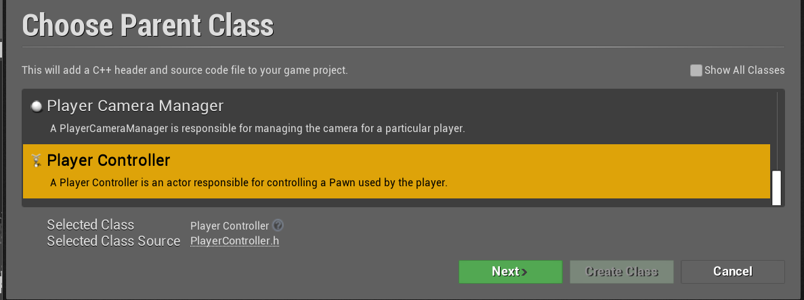

# Set up
Plan
1. Init C++ PawnBase
2. Applying Static Mesh on BP_Tank and BP_Turret Inherited from C++ PawnBase
3. Make New Class Inherited from C++ PawnBase for Tank and Turret.
4. Change ParentClass of BP_Tank and BP_Turret  

If Unreal Engine version is over 4.25, Causing Problem for making new c++ class. you can solve that problem


1. Correct the Path of header file.
2. Build and Update it. or Just Close all explorer for UE4 and Code, restart UE4.

## Why We use Pawn class instead of Character Class
Character class implicitly has input implementation. So you don't need to some extra things. But for Understand UE4, We would use Pawn class and Implementing everything by 

## derive BluePrint Class from C++ Class
- Blue Print allow us to make real-time change with visuality. So you can test very quickly and you can assign those test value on c++ code. 
- there are two ways to doing it.


- You can add camera with arms later


# Warnings
- Whever make large changes to either the constructor function, and especially adding new components into ther header file, It's going to be Recommended that Close the editor. So blue print Editor would show all of Components belong to C++ class


# Format Specifier 
- When declaring properties, Property Specifiers can be added to the declaration to control how the property behaves with various aspects of the Engine and Editor.

```c++
UPROPERTY(VisibleAnywhere, BluePrintReadOnly, Category="Components", meta = (AllowPrivateAccess="true"))
UPROPERTY(VisibleAnywhere, BlueprintReadOnly, Category = "Demo")
UPROPERTY(EditAnywhere, BlueprintReadWrite, Category = "Demo")
UPROPERTY(EditDefaultsOnly, Category = "Demo")
UPROPERTY(EditInstanceOnly, Category = "Demo")
UPROPERTY(VisibleDefaultsOnly, Category = "Demo")
UPROPERTY(VisibleInstanceOnly, Category = "Demo")
```
- First argument decide where you want to expose, whether it is possible to edit or ony visible.

- Second argument Choose in BluePrint Editor, If you add that you can search that components in BP Editor.

- Third argument add category where the variable would belong to.

- Fourth arguments needs when your variable declared in private section and it needs to be visible in BP Editor. So write down that on here.

[Unreal Document](https://docs.unrealengine.com/4.26/en-US/ProgrammingAndScripting/GameplayArchitecture/Properties/Specifiers/)


# C++ Derived class

After adding Static mesh on Turret and Tank on BP Editor, It's time to derive new c++ class from PawnBase.

After Adding PawnTank header and code file, cutting elements that wouldn't be used in header file.

```c++
void PawnTank::BeginPlay()
void PawnTank::Tick(float DeltaTime)
void PawnTank::SetupPlayerInputComponent(UInputComponent* PlayerInputComponent)

```

## Reparent Class

 - Set Possess Player to Player 0. SinglePlayer is always Player 0

## Camera Settings

- Enable Camera Lag Allow to smooth its movement.


# 4. ProjectileBase
## Implement Function on C++ script


Without those two specifier it still works but gives more detail is more informative.
- __Virtual__ : you can modifing this function on child class

- __Override__ : Not create new function but it was inherited.


## How to find Header file?
---
1. Searching in Google
2. In VSCode you could use Peek definition.


## Set BP Settings
---


## TSubclassOf<UDamageType> DamageType
---
```c++
	UPROPERTY(EditDefaultsOnly, Category="Damage")
	TSubclassOf<UDamageType> DamageType;
```
Above Code is for type safety. You can only Select Expected type.
in this session you would use basic, DamageType.


You also set to Tank and Turrets.


## PawnBase For Projectile
---
After Implementing ProjectileClass and TempProjectile on PawnBase, You needs to Specify the type on BP editor, tpa projectile type as BP_ProjectileBase.

If your Projectiles are Stucked in barrel, You needs to Adjust Projectile SpawnPoint 

## What is Dynamic Delegates
---
I try to explain it in the best way possible but I would really appreciate if my words get cross checked as I also want to know if I understand this correctly.

At 0:56 you can see Sam calling ProjectileMesh->OnComponentHit. 

In a Blueprint this would be an event like our BeginPlay. The difference is that BeginPlay is strictly bound to the blueprint that derives from this class. But what we want to achieve is to specifically react to the OnComponentHit event of a component within our class. In this case ProjectileMesh. This technique can also be applied to other components like the capsule collider of our tank. But like any event, without attaching a function to it nobody is there to listen to it when it gets triggered.

 This is where ProjectileMesh->OnComponentHit.AddDynamic(...) comes in place. AddDynamic will take a member function and register it as a listener. Now, whenever the OnComponentHit event of the ProjectileMesh is triggered it will delegate all its information to the previously registered function and execute it.

To further clarify: OnComponentHit is of type FComponentHitSignature which itself is a dynamic delegate. What it does is it observes a certain event in our world (in this case a hit event) and delegates any information related to that event to a function that we bind with AddDynamic as a listener to the event. AddDynamic itself is a helper macro that is available to all dynamic delegates. So basically it is an observer pattern.

Best is to read the AddDynamic function like: "Unreal, please register the following rule: Whenever the event to my left side is triggered I want to execute the function to my right side."

From [QnA](https://www.udemy.com/course/unrealcourse/learn/lecture/20648912#questions/12162162)


You can also see this, I can't understand What exactly is. But whenever you declare this function, you needs that arguments. care those commas. type and name of it was seperated by comma.
```c++
DECLARE_DYNAMIC_MULTICAST_DELEGATE_FiveParams( FComponentHitSignature, UPrimitiveComponent*, HitComponent, AActor*, OtherActor, UPrimitiveComponent*, OtherComp, FVector, NormalImpulse, const FHitResult&, Hit );
```


## ApplyDamage()
```c++
	/** Hurts the specified actor with generic damage.
	 * @param DamagedActor - Actor that will be damaged.
	 * @param BaseDamage - The base damage to apply.
	 * @param EventInstigator - Controller that was responsible for causing this damage (e.g. player who shot the weapon)
	 * @param DamageCauser - Actor that actually caused the damage (e.g. the grenade that exploded)
	 * @param DamageTypeClass - Class that describes the damage that was done.
	 * @return Actual damage the ended up being applied to the actor.
	 */
	UFUNCTION(BlueprintCallable, BlueprintAuthorityOnly, Category="Game|Damage")
	static float ApplyDamage(AActor* DamagedActor, float BaseDamage, AController* EventInstigator, AActor* DamageCauser, TSubclassOf<class UDamageType> DamageTypeClass);
```
- Third Argument. ___AController* EventInstigator___ : to seperate player to Team, or Checking this Event was done between A.I

- Why discriminate Actor and Controller? 
I think that is because Actor could be controlled either player and A.I.

## Error Handling
If your Bullet doesn't disaapear, You could delete your BP_Projectile and Make a New one derived from c++ class.

It was Happend Because you Instance the BP Object derived from c++ class. when that work are happend at once. exactly in the First time you Instance it. so you have to reparent it, or delete it for this. 

Constructor save resources, but if you are planning to test and change the variable, place code on beginplay rather than Constructor.
# 7. CreateGame Mode


## Setting Derived BP GameMode
Every Game need a game mode class to control what is spawned when the level is initialized.

If you don't provide it, the Default Game mode is going to be used.


You alread set __Auto Possess Player__ in the BP_PawnTank as a __Player 0__.
That settings is override the default settings that have done on Map and Mode.

So from this, you can delete BP_Tank, you don't have to Instance it By manually. and then Default Pawn would be Instanced at __Player Start__ 

This is Optional, If you intended to make multiplayer game, Set Player start's __Auto Receive Input__ that allow you which player is got which pawn.

You would get suspicious It was set disable in initial settings. but still work fine in single play. In singleplay, this would work without any problem. It just specifing the location where to spawn.

# 8. Creating Health Component
After Editing C++ Class Script, Also you have to dive into the BP_Editor, both Tank and Turret. And adding Health Components.


## Scene Components Vs Actor Components
---
- Actor Components : Attached Only an Actor not other components. No transform, Not exist in Viewport
- Scene Components : You can attach this whatsoever. It has transforms. Movable in ViewPort. It was Inherited from Actor Component.

There are few arguments that healthComponent should be made with transform. So HealthComponent will be implemented in Actor Components. It doesn't need to be shown on world. No transforms are needed.

## Little Tips
```c++
AProjectileBase::AProjectileBase()
	PrimaryComponentTick.bCanEverTick = false;
UHealthComponent::UHealthComponent()
	PrimaryComponentTick.bCanEverTick = false;
```
You can set this Evertick = false for saving resources.


## UGameplayStatics::GetActorOfClass()
```c++
/** 
	 *	Find all Actors in the world of the specified class. 
	 *	This is a slow operation, use with caution e.g. do not use every frame.
	 *	@param	ActorClass	Class of Actor to find. Must be specified or result array will be empty.
	 *	@param	OutActors	Output array of Actors of the specified class.
	 */
	static void GetAllActorsOfClass(const UObject* WorldContextObject, TSubclassOf<AActor> ActorClass, TArray<AActor*>& OutActors);
```
## DelegateFunction TakeDamage()
___
- This function is derived form __OnTakeAnyDamage()__

- The function that was created could have been called anything you wanted. It is being used to bind to the owners OnTakeAnyDamage event. When that happens all functions that were added to it get called e.g. in semi-pseudo code when damage happens
```c++
for every Func in OnTakeAnyDamageBoundFunctions:
Func(Arg1, Arg2, Arg3, ...);  
```

# 8. Create Widget

I think This parts is for Watching Video, Instead of write and read it.

there are so much content you needs.
Just Visiting here

[Lecture 152](https://www.udemy.com/course/unrealcourse/learn/lecture/20648930)

[Lecture 153](https://www.udemy.com/course/unrealcourse/learn/lecture/20648944)


Widget has its own hiearchy. The higher hiearchy place top of the lower things when rendered.

You can also Set the Text on Widget
1. Set the Resolution. Most stardard is 1920 X 1080


2. Set the Font and Location


3. In a graph, If you refer some Object yet to Instanced and that only instanced at BeginPlay, UE4 will be Crashed.


# 9. Editing Bluprint version of GameModeBase
Just Visiting And seeing the Video
[Lecture 154](https://www.udemy.com/course/unrealcourse/learn/lecture/20648948)

1. Delete Every BP_Function you don't needs that.

2. Override Function that is derived from GameModeBase.


# 11. Creating PlayerController
Player Controller interact with the Input. and It can adjust enable and disable the Controller
1. 

2. After Implementing this Script, make a variable APlayerControllerBase in GameModeBase header.

3. Make a New BP_Controller derived from C++ ControllerBase, then Change the settings of GameMode.


It also change the Project Settings


# 12. Creating Particle Effects
The trail needs to be a component so that it can follow the projectile and be destroyed when the projectile is destroyed as it just plays indefinitely.

Whereas the hit particle just plays at a static location and destroyed when it finished playing.
## Hitting and Death Effect
1. Declare the variable in 
```c++
// header
APawnBase::UParticleSystem*
APawnBase::UHealthComponent*
AProjectileBase::UParticleSystem*

// code
void APawnBase::HandleDestruction()
void AProjectileBase::OnHit()
```
2. and then, Go into BP_PawnTank, BP_PawnTurret. You could see 'Health' and 'Health Component' in Coponent Tap. Just delete 'Health' manually added on this. Now you could use variable declared in c++.

3. BP edit again in Tank, Turret, Projectile, Set the Effects Section for choosing Particles.

## Projectile tracing Effect
1. 
```c++
// header
AProjectileBase::UParticleSystemComponent

// code
void AProjectileBase::AProjectileBase()
{
	ProjectileSpawnPoint...
}
```

2. Editing BP_Projectile, Set the ___Particles's Template___


# 13. Implementing Audio
You can choose these two option.
```c++
UGameplayStatics::SpawnSound2D // For menu, Background Music.
UGameplayStatics::SpawnSoundAtLocation // has Lots of Interacting
```

## USoundBase vs UAudioComponent
UAudioComponent contains a USoundBase. The component is useful if you want the sound to travel along with the actor, or if you want to be able to start and stop it whenever you want.

In this case we just want to play it when the projectile hits something and that's it. So it's a "fire and forget" situation.

[Different ways to play a sound](https://answers.unrealengine.com/questions/428907/different-ways-to-play-a-sound.html)


1.
 ```c++
 // header
	AProjectileBase::USoundBase* HitSound;
	AProjectileBase::USoundBase* LaunchSound;
	APawnBase::USoundBase* DeathSound;

 // code
	void AProjectileBase::BeginPlay()
	{
		// If you want to Volumeup, four arguments is for that 
		UGameplayStatics::PlaySoundAtLocation(this, LaunchSound, GetActorLocation());
	}
	void AProjectileBase::OnHit()
	{
		...
	}
	void APawnBase::HandleDestruction()
	{
		...
	}
 ```

 2. BP_Editor -> Effects -> Set what you want. On Tank, Turret, Projectile.


# 14. Create Camera Shaking
|Before 4.26 | After 4.26 |
|-|-|
| UCameraShake |UMatineeCameraShake |
| ClientPlayCameraShake() | ClientStartCameraShake() |

1. Create BP_CameraShake


Pressing 'Shift + Click' spread all of the category

2. 
|Variable Name|Details|
|-|-|
|Oscillation Duration | How long to last|
|Rotation Osc & Field of view Option Osc | these two can cause motion sickness, If you choose to change it, then just give the option in your settings to disalbe and enable.|

3.


4.
```c++
// header
AProjectileBase::TSubclassOf<UCameraShake> HitShake;
APawnBase::TSubclassOf<UCameraShake> DeathShake;

// cpp

void AProjectileBase::OnHit()
{
	...
}

void APawnBase::HandleDestruction()
{
	...
}
```

5. Go into BP Editor of Tank, Turret, Projectile. and Set the Hit Shake and Explode Shake.


# Tips
## 1. Rotation Follows Velocity
BluePirnt Editor of BP_Projectile


## 2. Change the Cursor
BP editor of BP_PlayerController


## 3. Set Collision
Set collision on Turret and Tank.


## 4. Add Custom Settings for Project
Editor Startup is for developer

Game Default is for user


## 5. Set your Project's Quaility


# Pakaging


|Build Configuration|Unreal editing Contents|
|-|-|
|DebugGame| Many |
|Development| few |
|Shipping| None |

# Question.
Q. From this, The Pawn base didn't has BeginPlay(), Tick(), SetUp(), in this case, what kind of things are going to impact on BP Instance?

Q. Teacher didn't use including module But still fine whenever he compiles it. 

- that is because that module already included whatsoever. So regardless already done or not, Just recommend to include what you use.

Q. Why forward-declare is necessary in C++?

- Answered on Here, [StackOverFlow](https://stackoverflow.com/questions/4757565/what-are-forward-declarations-in-c)

Q. When the Class in header are Initialized? 
- all pointers are initialised in the constructor and not BeginPlay so initialising them in the class declaration would just be more typing, no harm in it though.

```c++
   class A 
   {
    public:
        A(int val) : a(val), b(5) {}
        int a = 5;
		int b = 4;
   }
```
-  ___int a___ is overrideed by Constructor. So always constructor overrides the value that already had been initialized.