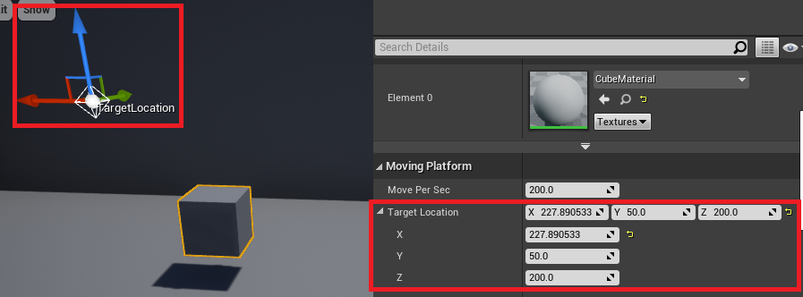

# Git merge #
    git fetch /path/to/project-a master
    git merge --allow-unrelated-histories FETCH_HEAD
    git remote remove project-a


# How to use Command #
[Command-Line Arguments for UE4](https://docs.unrealengine.com/4.27/en-US/ProductionPipelines/CommandLineArguments/)

> start { window tab title } { execution file } { Params }
## Server ##
    start "" "C:/Program Files/Epic Games/UE_4.27/Engine/Binaries/Win64/UE4Editor.exe" "D:/Unreal/thirdP/thirdP.uproject" "/Game/ThirdPersonCPP/Maps/ThirdPersonExampleMap" -server -log -nostream

## Client ##
    start "" "C:/Program Files/Epic Games/UE_4.27/Engine/Binaries/Win64/UE4Editor.exe" "D:/Unreal/thirdP/thirdP.uproject" 127.0.0.1 -game -WINDOWED -ResX=800 -ResY=900 -WinX=0 -WinY=20 -log -nosteam


# Feature for Movable Actor
- UE4 combine actor's transform with attaching. it also affect the caculation btw client and server.
- Actor move when setting Mobility option to Movable.
``` c++
AMovingPlatform::AMovingPlatform() {
    PrimaryActorTick.bCanEverTick = true;
    SetMobility(EComponentMobility::Movable);
}
```

## Gizmo
- Add Gizmo on FVector
- The Gizmo's FVector is Local not global

```c++
UPROPERTY(EditAnywhere, meta = (MakeEditWidget=true))
FVector TargetLocation;
```


# Server's Role
- Calculate Actor and it's movement on Server and replicate it to clients.
- It allow to control all of clients in server. calculation works only in Server

## Replication and Authority
- Actor is container transfer info btw client and server.
- Server send updates of replicated actor and it's replicated property.
- Updates Actor only in Client is possible but whenever Server didn't agree with it, Set the status to that server allow.

## Replicates Information only in Server
- Only server has authority and could replicates actor and it's property. Every actor has authority function return wheter run in server or not. Use this for Server functionality.


if working on server, set this actor to be replicated
``` c++
AMovingPlatform::AMovingPlatform() {
    ...    
    if (HasAuthority()) {
        SetReplicates(true);
        SetReplicateMovement(true);
    }
}
```

Calculating Movement only in server.
```c++
void AMovingPlatform::Tick(float DeltaTime)
{
    Super::Tick(DeltaTime);
    if (HasAuthority()) {
        FVector Location = GetActorLocation();
        Location += FVector(MovePerSec * DeltaTime, 0, 0);
        SetActorLocation(Location);

        if(Location.X > 800.f ){
            MovePerSec *= -1;
        }
        if (Location.X < 0.f) {
            MovePerSec *= -1;
        }
    }
}
```

[FTransform](https://docs.unrealengine.com/4.27/en-US/API/Runtime/Core/Math/FTransform/)

- TargetLocation is Local needs translating to global. Use Actor's Transform and translating local to global. 
- SafeNormal is normalized vector return Zero if the value is small enough lossing it's information.
- this way works with any scaling and rotation.

### `Translate to global` ###
```c++
void AMovingPlatform::Tick(float DeltaTime)
{
    Super::Tick(DeltaTime);
    if (HasAuthority()) {
        FVector Location = GetActorLocation();
        FVector Direction = GetTransform().TransformPosition(TargetLocation)  - GetActorLocation();
        Direction = Direction.GetSafeNormal();
        Location += MovePerSec * DeltaTime * Direction;
        SetActorLocation(Location);
        if (Location.X > 800.f) {
            MovePerSec *= -1;
        }
        else if (Location.X < 0.f) {
            MovePerSec *= -1;
        }
    }
}
```

### `Use Local` ###
``` c++
void AMovingPlatform::Tick(float DeltaTime)
{
    Super::Tick(DeltaTime);
    if (HasAuthority()) {
        FVector Location = GetActorLocation();
        Location += MovePerSec * DeltaTime * TargetLocation.GetSafeNormal();
        SetActorLocation(Location);
        if (Location.X > 800.f) {
            MovePerSec *= -1;
        }
        else if (Location.X < 0.f) {
            MovePerSec *= -1;
        }
    }
}

```

## assert ##
[UE4 Documentation for assert](https://docs.unrealengine.com/4.27/en-US/ProgrammingAndScripting/ProgrammingWithCPP/Assertions/)

__ensure__ : marcro check null pointer. it doesn't make crash, log on console.


## UPROPERTY Specifier ##
- It's interesting that visibleAnywhere allow to change it's property.

|VisibleAnywhere|EditAnywhere|
|-|-|
|fixed|reassignable|
|changable property | changable property


``` c++
UPROPERTY(VisibleAnywhere)
UPROPERTY(EditAnywhere)
```
