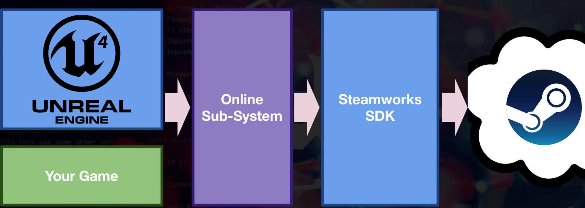
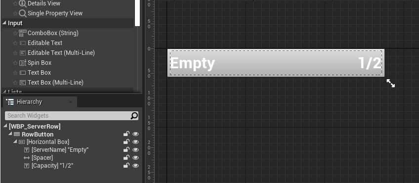
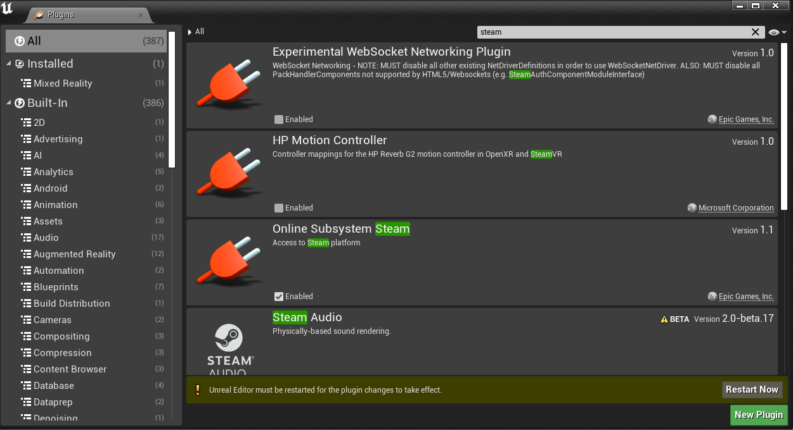

# 1. Hosting and Joining
# Git merge #
    git fetch /path/to/project-a master
    git merge --allow-unrelated-histories FETCH_HEAD
    git remote remove project-a


# How to use Command #
[Command-Line Arguments for UE4](https://docs.unrealengine.com/4.27/en-US/ProductionPipelines/CommandLineArguments/)

> start { window tab title } { execution file } { Params }
## Server ##
    start "" "C:/Program Files/Epic Games/UE_4.27/Engine/Binaries/Win64/UE4Editor.exe" "D:/Unreal/thirdP/thirdP.uproject" "/Game/ThirdPersonCPP/Maps/ThirdPersonExampleMap" -server -log -nostream

## Client ##
    start "" "C:/Program Files/Epic Games/UE_4.27/Engine/Binaries/Win64/UE4Editor.exe" "D:/Unreal/thirdP/thirdP.uproject" 127.0.0.1 -game -WINDOWED -ResX=800 -ResY=900 -WinX=0 -WinY=20 -log -nosteam


# Feature for Movable Actor
- UE4 combine actor's transform with attaching. it also affect the caculation btw client and server.
- Actor move when setting Mobility option to Movable.
``` c++
AMovingPlatform::AMovingPlatform() {
    PrimaryActorTick.bCanEverTick = true;
    SetMobility(EComponentMobility::Movable);
}
```

## Gizmo
- Add Gizmo on FVector
- The Gizmo's FVector is Local not global

```c++
UPROPERTY(EditAnywhere, meta = (MakeEditWidget=true))
FVector TargetLocation;
```


# Server's Role
- Calculate Actor and it's movement on Server and replicate it to clients.
- It allow to control all of clients in server. calculation works only in Server

## Replication and Authority
- Actor is container transfer info btw client and server.
- Server send updates of replicated actor and it's replicated property.
- Updates Actor only in Client is possible but whenever Server didn't agree with it, Set the status to that server allow.

## Replicates Information only in Server
- Only server has authority and could replicates actor and it's property. Every actor has authority function return wheter run in server or not. Use this for Server functionality.


if working on server, set this actor to be replicated
``` c++
AMovingPlatform::AMovingPlatform() {
    ...    
    if (HasAuthority()) {
        SetReplicates(true);
        SetReplicateMovement(true);
    }
}
```

Calculating Movement only in server.
```c++
void AMovingPlatform::Tick(float DeltaTime)
{
    Super::Tick(DeltaTime);
    if (HasAuthority()) {
        FVector Location = GetActorLocation();
        Location += FVector(MovePerSec * DeltaTime, 0, 0);
        SetActorLocation(Location);

        if(Location.X > 800.f ){
            MovePerSec *= -1;
        }
        if (Location.X < 0.f) {
            MovePerSec *= -1;
        }
    }
}
```

[FTransform](https://docs.unrealengine.com/4.27/en-US/API/Runtime/Core/Math/FTransform/)

- TargetLocation is Local needs translating to global. Use Actor's Transform and translating local to global. 
- SafeNormal is normalized vector return Zero if the value is small enough lossing it's information.
- this way works with any scaling and rotation.

### `Translate to global` ###
```c++
void AMovingPlatform::Tick(float DeltaTime)
{
    Super::Tick(DeltaTime);
    if (HasAuthority()) {
        FVector Location = GetActorLocation();
        FVector Direction = GetTransform().TransformPosition(TargetLocation)  - GetActorLocation();
        Direction = Direction.GetSafeNormal();
        Location += MovePerSec * DeltaTime * Direction;
        SetActorLocation(Location);
        if (Location.X > 800.f) {
            MovePerSec *= -1;
        }
        else if (Location.X < 0.f) {
            MovePerSec *= -1;
        }
    }
}
```

### `Use Local` ###
``` c++
void AMovingPlatform::Tick(float DeltaTime)
{
    Super::Tick(DeltaTime);
    if (HasAuthority()) {
        FVector Location = GetActorLocation();
        Location += MovePerSec * DeltaTime * TargetLocation.GetSafeNormal();
        SetActorLocation(Location);
        if (Location.X > 800.f) {
            MovePerSec *= -1;
        }
        else if (Location.X < 0.f) {
            MovePerSec *= -1;
        }
    }
}

```

## assert ##
[UE4 Documentation for assert](https://docs.unrealengine.com/4.27/en-US/ProgrammingAndScripting/ProgrammingWithCPP/Assertions/)

__ensure__ : marcro check null pointer. it doesn't make crash, log on console.


## UPROPERTY Specifier ##
- It's interesting that visibleAnywhere allow to change it's property.

|VisibleAnywhere|EditAnywhere|
|-|-|
|fixed|reassignable|
|changable property | changable property


``` c++
UPROPERTY(VisibleAnywhere)
UPROPERTY(EditAnywhere)
```

## Dynamic Event ##
Delegates
```c++
// .h
TriggerVolume->OnComponentBeginOverlap.AddDynamic(this, &APlatformTrigger::OnOverLapBegin);
```

```c++
void APlatformTrigger::OnOverLapBegin(UPrimitiveComponent* OverlappedComponent, AActor* OtherActor, UPrimitiveComponent* OtherComp, int32 OtherBodyIndex, bool bFromSweep, const FHitResult& SweepResult)

```


# Game Instance #
Game Instance apply Logic to different level.
- Good for console command flags
- Use this for hosting server and joining

1. Create Game Instance Class in C++
2. Project Settings -> Game Instance -> Choose custom Game Instance
- Each Player has own Game Instance

## Init() vs Constructor ##
- Start editor call constructor
- Start game call Constructor and Init in sequential order.


>Tips: Create default constructor with parent's signature. much safer.
```c++
class THIRDP_API UPuzzleGameInstance : public UGameInstance{}

UPuzzleGameInstance::UPuzzleGameInstance(const class FObjectInitializer& ObjectInitializer);

UGameInstance::UGameInstance(const FObjectInitializer& ObjectInitializer);
```


## Exec Keyword ##
In game backslash( ` ) helps to execute command and UFUNCTION(Exec) create a command with function name.
```c++
    UFUNCTION(Exec)
    void Host();
```
 ___theses Class use Exec keyword.___
- PlayerControllers
- Pawn Possessed by Controller
- HUDs
- Cheat Managers
- Game Modes
- Game Instances

## Log on Screen ##
- c-style printf with format specifier
 ```c++
FString X = FString::Printf(TEXT("%s %s "), TEXT(__FUNCTION__),*Address);
FString Y = TEXT(__FUNCTION__) + FString("192.168.111.0");
 ```

- set unique key to -1 means making new log line
```c++
void UPuzzleGameInstance::Join(const FString& Address)
{
    UEngine* Engine = GetEngine();
    if (ensure(Engine != nullptr)) {
        Engine->AddOnScreenDebugMessage(-1, 5, FColor::Cyan, FString::Printf(TEXT("%s %s "), TEXT(__FUNCTION__),*Address));
    }
}
```


# Switching Map

## Server Travel
use ServerTravel for two main reason
1. Move to Map
2. Hosting Server with 'listen' keyword
3. Move each player to another map one by one.

```c++
void UPuzzleGameInstance::Host()
{
    UWorld* World = GetWorld(); // GWorld instead
    if (ensure(World != nullptr)) {
        World->ServerTravel("/Game/ThirdPersonCPP/Maps/ThirdPersonExampleMap?listen");
    }
}
```

## Clien Travel
Use for connecting to server
```c++
void UPuzzleGameInstance::Join(const FString& Address)
{
    if (ensure(GWorld != nullptr)) {
        APlayerController* PController = GetFirstLocalPlayerController(GWorld);
        PController->ClientTravel(Address, ETravelType::TRAVEL_Absolute);
    }
}

```

## share with others
[itch.io](https://itch.io/)
use itch's application protect your machine from any random executable.
sandbox mode prohibiting executable to access out of it.


# __2. UI System__
## Widget BluePrint for display
Anchor adjust relative location of the data.


## C++ code for functionality
The Parent class of WBP is UUserWidget


## Include BluePrint in C++ Code

> add UMG Module on your project in {file}.Build.cs
``` c#
PublicDependencyModuleNames.AddRange(new string[] { "UMG" });
```
> include UserWidget.h

> take every subclass of it for referencing

``` c++
//ProjectInstance.cpp
#include <Blueprint/UserWidget.h>
UPuzzleGameInstance::UPuzzleGameInstance(const FObjectInitializer & ObjectInitializer){
    ConstructorHelpers::FClassFinder<UUserWidget>MenuClass(TEXT("/Game/UI/WBP_MainMenu")); // Only in Constructor
    //if (MenuClass.Succeeded()) 
    if(ensure(MenuClass.Class!= nullptr)) // pointer to class for instantiation
    {
        UIMenu = MenuClass.Class;
        UE_LOG(LogTemp, Warning, TEXT("Detecting %s"), *UIMenu.Get()->GetName());
    }

}

```
- __FClassFinder can only be used from a constructor__


> Class "TSubclassOf" help to get the subclass belong to specific class

-  TSubclassOf is a template that takes a type and restricts the type we can assign to MenuClass in the blueprint. What we are say here is that the MenuClass variable should hold a class itself (not a pointer or and instance of a class).
```c++
// ProjectInstance.h
private:
    UPROPERTY()
    TSubclassOf<class UUserWidget> UIMenu;
```

> Place it on beginplay or OnStart
- OnStart called  when gameinstance is starting. GameInstance created before the world do.
- Call UUserWidget on init or constructor is too early. the viewport is before creating. call this on beginplay or Onstart
- UE4 Editor didn't call StartGameInstanced. it only works on Game only clients
```c++
// For the sake of clean code, remove every if statements for check nullptr.
void UPuzzleGameInstance::OnStart()
{
    Super::OnStart();
    UUserWidget* Menu = CreateWidget<UUserWidget>(this, UIMenu);
    Menu->AddToViewport(0);
    UE_LOG(LogTemp, Warning, TEXT("Create Widget on your screen %s"), TEXT(__FUNCTION__));
}

void UPuzzleGameInstance::CloseMenu()
{
    GetWorld()->GetGameViewport()->RemoveAllViewportWidgets();
}
```

BluePrint version is quite interesting.


## Turn on Mouse
FInputModeDataBase
- FInputModeUIOnly
- FInputModeGameAndUI
- FInputModeGameOnly
```c++
void UPuzzleGameInstance::CloseMenu()
{
    GetFirstLocalPlayerController(GWorld)->SetShowMouseCursor(false);
    GetFirstLocalPlayerController(GWorld)->SetInputMode(FInputModeGameOnly());
}

void UPuzzleGameInstance::OpenMenu()
{
    GetFirstLocalPlayerController(GWorld)->SetShowMouseCursor(true);
    FInputModeGameAndUI FInputMode;
    FInputMode.SetHideCursorDuringCapture(false); // solve shaking in camera
    GetFirstLocalPlayerController(GWorld)->SetInputMode(FInputMode);
}
```

if you see errors "LogPlayerController: Error: InputMode:UIOnly - Attempting to focus Non-Focusable widget SObjectWidget [Widget.cpp(710)]!", just set below code on yours.

```c++
MainMenu->bIsFocusable = true;
```

## UMG Widget ##
Every Widget has property relating Parent Widget.

[see WBP_MainMenu_Practice](.\Content\UI\WBP_MainMenu_Practice.uasset)


## Button Styling ##
[UE4 Documentation for Styling](https://docs.unrealengine.com/4.27/en-US/InteractiveExperiences/UMG/UserGuide/Styling/)

adjust only outline of button


[Google Fonts](https://fonts.google.com/)


- wrap background with scale box. set stretch to scale to fill. for blocking awkward ratio.
- Draw option for button's border setting.


## settings for interactive button
set normal, pressed, clicked.

<br>
<br>

## C++ implementation for button
> Create C++ UserWidget, reparent WBP_MainMenu to C++ User Widget.

Reference: [Benhumphreys's blog for biding blueprints with c++ class](https://benui.ca/unreal/ui-bindwidget/)

- UPROPERTY set everything simple without any complicated matter. Just add "meta = (BindWidget)" on your UPROPERTY arguments. It directly binds to your BP's widget.
```c++
//#include "Components/Button.h"
UPROPERTY(meta = (BindWidget))
class UButton* HostButton;

UPROPERTY(meta = (BindWidget))
class UButton* JoinButton;

UPROPERTY(meta = (BindWidget))
class UButton* ExtraButton;
```

Set Above cause below error message.
> It requires same naming in blueprint widget


### Start with Initialize instead of beginplay
- UserWidget doesn't have beginplay, Initialize() is propert member fucntion to call these kind of things.
- NativeConstructor is also good choice.

Initialize() -> NativeConstructor()
```c++
virtual bool Initialize() override;
virtual bool NativeConstructor() override;

```

### Bind clicking with function.
> bind with delegate

-  Onclicked variable only takes Delegate with no Params
```c++
// No arguments needed
DECLARE_DYNAMIC_MULTICAST_DELEGATE(FOnButtonClickedEvent);

// Four Params
DECLARE_DYNAMIC_MULTICAST_DELEGATE_FourParams(FInstigatedAnyDamageSignature, float, Damage, const UDamageType*, DamageType, AActor*, DamagedActor, AActor*, DamageCauser);
```

> Function for Delegate must be declared with UFUNCTION
```c++
// .h
UFUNCTION()
void DelegateForExtraButton();

// .cpp
void UMainMenu::DelegateForExtraButton()
{
	UPuzzleGameInstance* GameInstance = Cast<UPuzzleGameInstance>(GetGameInstance());
	GameInstance->Host();
}

bool UMainMenu::Initialize()
{
	if(Super::Initialize() ==false) return false;
    ExtraButton->OnClicked.AddDynamic(this, &UMainMenu::DelegateForExtraButton);
	
	return true;
}
```


# Dependency Inversion
> 1.Create C++ Unreal Interface Class. header have two class.
- Unreal's reflection system detect every class belong to UObject. UInterface's child, UMenuInterface is for that.
- inheritancing in both UserWidget and Game Instance cause diamond inheritance problem. So it needs another class has no parent, IMenuInterface.

 ```c++
 // MenuInterface.h
class IMenuInterface
{
public:
	// Declare Pure Virtual Function
	virtual void Host() = 0;
	virtual void Join(const FString& Address) = 0;
	virtual void Play() = 0;
};

// PuzzleGameInstance.h
 class UPuzzleGameInstance : public UGameInstance, public IMenuInterface // Added
```

```c++
// MainMenu.h
class UMainMenu : public UUserWidget{
private:
	class IMenuInterface* MenuInterface;
}

// MainMenu.cpp
void UMainMenu::DelegateForHostButton()
{
    MenuInterface->Host();
}
 ```
- MenuInterface.h will never depend on MainMenu.h so we don't need to worry about circular dependency

- interface doesn't actually exist after compilation and the MainMenu just calls the function directly on the GameInstance


## Is interface class necessary?
> You can think of an interface as a contract of what a specific system or class will contain.  For example, right now our game instance uses the built in functions for networking and multiplayer, but in the future you may want to use steam, or maybe you wand to publish to Xbox and for these the Host and Join functions may need to do additional steps. This would require you to build out different game instance classes and functions. Without the interface your menu code would have to

> 1. figure out what game instance class your using
>2. go through a cast
> 3. go through a switch statement to figure out what code to call

>by using an interface it Guarantees whatever game instance is implementing the interface has a Host and Join function that take the same arguments so the code you write in menu system can just assume you can call gameinstance->Host()

[Implement Code](https://github.com/UnrealMultiplayer/2_Menu_System/commit/7c4c32cac2b805bb45d289cb4d54f123fc9e75c6)
```c++
void UPuzzleGameInstance::OpenMenu()
{   
    //Menu = CreateWidget<UUserWidget>(this, UIMenu);
    Menu = CreateWidget<UMainMenu>(this, UIMenu);
    
    Menu->TakeWidget();
    Menu->AddToViewport(0);

    Menu->SetMenuInterface(this); // Added
}
```

# Architectural Pattern
An architectural pattern is a general, reusable solution to a commonly occurring problem in software architecture within a given context.

# SOLID 
first five object-oriented design (OOD) principles
|Abb |details |
|-|-|
|S | Single-responsiblity Principle |
|O | Open-closed Principle |
|L | Liskov Substitution Principle |
|I | Interface Segregation Principle |
|D | Dependency Inversion Principle  |

## Inversion of Control
if a class needs another class for functionality, another class is dependency.
Normally a class intantiate another class inside of the class, but applying Inversion of Control, Out of the class assign the Instance of the another class into the calss. this is what inversion of control.
[Youtube Video explaining about Inversion Control](https://www.youtube.com/watch?v=EPv9-cHEmQw)
## Dependency Injection 
Instead of creating dependency in the class, take it from method as a parameter is dependency injection. Use interface class for parameter makes more generic code.
> Dependency Inversion Principle:
>> Rely on abstractions rather than concrete implementations

[Youtube video explaining dependency injection](https://www.youtube.com/watch?v=IKD2-MAkXyQ)

## Compile/Run time dependency
Hard coding is Compile time dependency. Only Change the code could use different class. Run time dependency is vice versa. using interface class allow to decide which class is using at compile time.


## Refactoring Code 
```c++
// MainMenu.cpp 
void UMainMenu::NativeConstruct()
{
	Super::NativeConstruct();

    GetOwningPlayer()->SetShowMouseCursor(true);
    FInputModeGameAndUI FInputMode;
    FInputMode.SetHideCursorDuringCapture(false); // for shaking in camera
    GetOwningPlayer()->SetInputMode(FInputMode);
}

void UMainMenu::NativeDestruct()
{
    GetOwningPlayer()->SetShowMouseCursor(false);
    GetOwningPlayer()->SetInputMode(FInputModeGameOnly());

	Super::NativeDestruct();
}

// PuzzleGameInstance.cpp
void UPuzzleGameInstance::CloseMenu()
{
    if (ensure(Menu != nullptr)) {
        Menu->RemoveFromViewport(); // Call NativeDestructor
    }
}
```

## Why Change level close Menu?
```c++
virtual void UUserWidget::OnLevelRemovedFromWorld(...);
```

- Called when a top level widget is in the viewport and the world is potentially coming to and end. When this occurs, 
- it's not save to keep widgets on the screen.  We automatically remove them when this happens and mark them for pending kill.


## Editing Widget BluePrint
Use {Behavior} -> {Tool Tip Text} for explanation

{Canvas panel -> Size To Content} is So useful

<br><br>

WidgetSwitcher


```c++
UPROPERTY(meta = (BindWidget))
class UWidgetSwitcher* MenuSwitcher;
    
UPROPERTY(meta = (BindWidget))
class UEditableTextBox* AddrBox;

UPROPERTY(meta = (BindWidget))
UWidget* JoinOverlay;

class IMenuInterface* MenuInterface;
```

switching two variable
```c++
void UMainMenu::DelegateForJoinButton()
{
	MenuSwitcher->SetActiveWidget(JoinOverlay);
}

void UMainMenu::DelegateForCancelButton()
{
	MenuSwitcher->SetActiveWidgetIndex(0);
}

void UMainMenu::DelegateForAddrButton()
{
	FString Address{ AddrBox->GetText().ToString() };
	MenuInterface->Join(Address);
}
```


# Error handling with event dirven trigger
```c++
// .h
UFUNCTION()
void HandleNetworkFailure(UWorld* World, UNetDriver* NetDriver, ENetworkFailure::Type FailureType, const FString& ErrorString);
UFUNCTION()
void HandleTravelFaliure(UWorld* World, ETravelFailure::Type FailureType, const FString& ErrorString);
```

```c++
//.cpp
void UMainMenu::HandleNetworkFailure(UWorld* World, UNetDriver* NetDriver, ENetworkFailure::Type FailureType, const FString& ErrorString)
{
	UE_LOG(LogTemp, Warning, TEXT("Damn s NetworkError %s"), *ErrorString);
}

void UMainMenu::HandleTravelFaliure(UWorld* World, ETravelFailure::Type FailureType, const FString& ErrorString)
{
	UE_LOG(LogTemp, Warning, TEXT("Damn s TravelError %s"), *ErrorString);
}

void UMainMenu::NativeConstruct()
{
	Super::NativeConstruct();

	GEngine->OnNetworkFailure().AddUObject(this, &UMainMenu::HandleNetworkFailure);
	GEngine->OnTravelFailure().AddUObject(this, &UMainMenu::HandleTravelFaliure);
}
```


# Online SubSystem
https://www.udemy.com/course/unrealmultiplayer/learn/lecture/7947920#questions/5962040

https://medium.com/swlh/building-and-hosting-an-unreal-engine-dedicated-server-with-aws-and-docker-75317780c567

https://www.youtube.com/watch?v=tOy0xYaP3wA


# 3. Online Multiplayer, Steam SDK

## Test Steam Samples


install 

1. make sure you install the directx sdk (june 2010) (https://www.microsoft.com/en-us/download/details.aspx?id=6812 45)
2. Once you unzip the steamworks sdk and open “SteamworksExample.sln”, right-click the project in the solution explorer and choose “properties” and select the “VC++ Directories” on the left of the window
3. Click on the “Include Directories” on the right side of the line where the paths are listed and you will see a dropdown selection, click that and in there you should see “Edit”, click that and it opens a new window.
4. Click the yellow folder icon at the top right, then click the 3 dots to choose the include folder (C:\Program Files (x86)\Microsoft DirectX SDK (June 2010)\Include), then click ok to go back to the properties window.
5. Now click on the “Library Directories” the same way you did the include (right side of the window, “edit”,) and once again click the yellow folder icon and select this path (C:\Program Files (x86)\Microsoft DirectX SDK (June 2010)\Lib\x86) and click ok and ok again to close the properties window.
6. Rebuild the program and it should compile.

Include path to add

C:\Program Files (x86)\Microsoft DirectX SDK (June 2010)\Include

Library path to add

C:\Program Files (x86)\Microsoft DirectX SDK (June 2010)\Lib\x86

## Use Unreal Subsystem
What is Online Subsystem?
- The Online Subsystem and its interfaces provide a common way to access the functionality of online services such as Steam, Xbox Live, Facebook, and so on

How to use it?
{Project Name}.build.cs
```c++
PublicDependencyModuleNames.AddRange(new string[] { "OnlineSubsystem" });
```
PuzzleGameInstance.cpp is Good place to include OnlineSubsystem.

```c++
#include <OnlineSubsystem.h>
```
- __If your intelisense doesn't detect OnlineSubsystem.h, then regenerate solution file.__

Test Whether OnlineSubsystem works in code.
```c++
#include <OnlineSessionSettings.h>
void UPuzzleGameInstance::Init()
{
    /* Set OnlineSubsystem */
    IOnlineSubsystem* OSS = IOnlineSubsystem::Get();
    if (OSS != nullptr) {
		UE_LOG(LogTemp, Warning, TEXT("Create OnlineSubsystem : %s"), *OSS->GetSubsystemName().ToString());
        IOnlineSessionPtr SessionInterface = OSS->GetSessionInterface();
        if (SessionInterface.IsValid()) { // check shared pointer with valid method not != nullptr
			UE_LOG(LogTemp, Warning, TEXT("Create Session"));
        }
    }
}
```

## How Reflection system works when destorying Actor
- When an AActor or UActorComponent is destroyed or otherwise removed from play, all references to it that are visible to the reflection system (UProperty pointers and pointers stored in Unreal Engine container classes such as TArray) are automatically nulled.

- If you want an Object pointer that is not a UProperty, consider using __TWeakObjectPtr__. This is a "weak" pointer, meaning it will not prevent garbage collection, but it can be queried for validity before being accessed and will be set to null if the Object it points to is destroyed.

__So there is two way to avoid circular dependency, 1. use UProperty 2. use Tweakptr__

## OnlineSession
Each game created on server is Session. Figuring out how to use Session
https://docs.unrealengine.com/4.27/en-US/ProgrammingAndScripting/Online/SessionInterface/


## Observer pattern
- OnlineSession notify it's completion with delegates
- publisher notify subscriber with formatted interface, call this [Observer pattern](https://refactoring.guru/design-patterns/observer)


```c++
#include <Interfaces/OnlineSessionInterface.h>

```

create session callback broadcast other to notify compliation of session 


## TOptional
- TOptional didn't take invalid type
- When we have an optional value IsSet() returns true, and GetValue() is meaningful. Otherwise GetValue() is not meaningful.

```c++
if (SelectedIndex.IsSet()) {
    UE_LOG(LogTemp, Warning, TEXT("selected index %d"), SelectedIndex.GetValue());
}
```

## Interacting btw MainMenu and ServerRow
- Interacting each other with the other's member function.
- MainMenu call ServerRow's FromMainMenuSet
- ServerRow call MainMenu's FromServerRowSetIndex

1. Add Text and button on WBP_ServerRow

2. ServerRow.h and ServerRow.cpp
```c++
// ServerRow.cpp
void UServerRow::DelegateForRowButton()
{
	MainMenu->FromServerRowSetIndex(index);
}

void UServerRow::NativeConstruct()
{
	RowButton->OnClicked.AddDynamic(this, &UServerRow::DelegateForRowButton);
}

void UServerRow::FromMainMenuSet(UMainMenu* Menu, uint32 i)
{
	MainMenu = Menu;
	index = i;
}
```

3. MainMenu.h and MainMenu.cpp
```c++
// MainMenu.h
private: 
	TOptional<uint32> SelectedIndex;

// MainMenu.cpp
void UMainMenu::UpdateServerList(TArray<FString> ServerNames)
{
	int16 index = 0;
	for (const FString& ServerName : ServerNames) {
		UServerRow* Row = CreateWidget<UServerRow>(this, ServerRowClass); // Call Native Constructor
		if (ensure(Row != nullptr)) {
			Row->ServerName->SetText(FText::FromString(ServerName));
			Row->FromMainMenuSet(this, index++);
			ServerList->AddChild(Row);
		}
	}
}
void UMainMenu::FromServerRowSetIndex(uint32 i)
{
	SelectedIndex = i;
}

void UMainMenu::DelegateForAddrButton()
{
	if (SelectedIndex.IsSet()) {
		UE_LOG(LogTemp, Warning, TEXT("selected index %d"), SelectedIndex.GetValue());
	}
}
```


## connect the other with JoinSession
1. UMainMenu.cpp
```c++
void UMainMenu::DelegateForAddrButton()
{
	if (SelectedIndex.IsSet() && MenuInterface != nullptr) {
		MenuInterface->Join(SelectedIndex.GetValue());
	}
}
```

2. GameInstance.cpp
```c++
void UPuzzleGameInstance::Join(uint32 i)
{
    SessionInterface->JoinSession(0, FName(), SessionSearch->SearchResults[i]);
} 

void UPuzzleGameInstance::Init()
{
    SessionInterface->OnJoinSessionCompleteDelegates.AddUObject(this, &UPuzzleGameInstance::OnJoinSessionComplete);
}

void UPuzzleGameInstance::OnJoinSessionComplete(FName SessionName, EOnJoinSessionCompleteResult::Type Result)
{
    FString Address;
    if (!SessionInterface->GetResolvedConnectString(SessionName, OUT Address))
        return;
    APlayerController* PController = GetFirstLocalPlayerController(GWorld);
    PController->ClientTravel(Address, ETravelType::TRAVEL_Absolute);
}
````

SessionInterface->OnJoinSessionCompleteDelegates takes below.
```c++
typedef TMulticastDelegate_TwoParams< void, FName, EOnJoinSessionCompleteResult::Type > FOnJoinSessionComplete
```


# Work with OSS Steam
Lecture 63.

```c++
// {Project}.Build.cs
PublicDependencyModuleNames.AddRange(new string[] { "OnlineSubsystemSteam" });

```


Set __Config/DefaultEngine.ini__
```txt
[/Script/Engine.GameEngine]
+NetDriverDefinitions=(DefName="GameNetDriver",DriverClassName="OnlineSubsystemSteam.SteamNetDriver",DriverClassNameFallback="OnlineSubsystemUtils.IpNetDriver")

[OnlineSubsystem]
DefaultPlatformService=Steam

[OnlineSubsystemSteam]
bEnabled=true
SteamDevAppId=480

; If using Sessions
; bInitServerOnClient=true

[/Script/OnlineSubsystemSteam.SteamNetDriver]
NetConnectionClassName="OnlineSubsystemSteam.SteamNetConnection"
```

executeion batch file for logging
```txt
start "" "C:/Program Files/Epic Games/UE_4.27/Engine/Binaries/Win64/UE4Editor.exe" "D:/Unreal/UE4_Learning/thirdP/thirdP.uproject" -game -LOG -WINDOWED -ResX=800 -ResY=900 -WinX=0 -WinY=20
```
after executing it, write down this command for more log message.
```
Log LogOnline Verbose
Log LogOnline VeryVerbose
```

or add it on DefaultEngine.ini
```txt
[Core.Log]
LogOnline=VeryVerbose
LogOnlineGame=VeryVerbose
```
for batch file
```txt
"D:\Program Files\UE_4.22\Engine\Binaries\Win64\UE4Editor.exe" "C:\Users\User\Documents\Unreal Projects\PuzzlePlatforms\PuzzlePlatforms.uproject" -game -log -windowed -resx=1280 -resy=720 -logcmds="logonline VeryVerbose, logonlinegame VeryVerbose"
```

### 17 "Presence" For Steam Lobbies ###
It needs Two Machine and Two Steam Accounts
Lect65
+ Enabling presence for the server.
+ Enabling presence for search.
+ Debugging our connection.

```c++
void UPuzzleGameInstance::CreateSession(FName SessionName)
{
    FOnlineSessionSettings SessionSettings;
    SessionSettings.bIsLANMatch = false; // Use Steam OSS
    SessionSettings.NumPublicConnections = 3;
    SessionSettings.bShouldAdvertise = true; // Set visible in querying
    SessionSettings.bUsesPresence = true; // For Steam OSS
    SessionSettings.bUseLobbiesIfAvailable = true; // For Steam OSS
    SessionInterface->CreateSession(int32(0), SessionName, SessionSettings);
}
void UPuzzleGameInstance::Update()
{
	SessionSearch = MakeShareable(new FOnlineSessionSearch());
    //SessionSearch->bIsLanQuery = true;
    SessionSearch->MaxSearchResults = 100;
    SessionSearch->QuerySettings.Set(SEARCH_PRESENCE, true, EOnlineComparisonOp::Equals); // With API
    SessionInterface->FindSessions(0, SessionSearch.ToSharedRef()); // Add Session to SessionSearch 
}
```

### Filtering Lobby
The ID the tutorial uses is for Spacewar and many other steam devs use it for debugging networking. If you want to filter the list to just lobbies for your project, you can add the following to your game instance:

```c++
//Inside CreateSession:
SessionSettings.Set(SEARCH_KEYWORDS, FString("MyUniqueKeyword"), EOnlineDataAdvertisementType::ViaOnlineServiceAndPing);

//And inside Refresh Server List:
SessionSearch->QuerySettings.Set(SEARCH_KEYWORDS, FString("MyUniqueKeyword"), EOnlineComparisonOp::In);
```

### Inviting Friends Directly
https://community.gamedev.tv/t/join-game-directly-or-via-invite/191615


https://community.gamedev.tv/t/testing-solo-with-windows-sandbox/161684